# Competitor landscape

How people discover and schedule Edinburgh Fringe shows today, and how each
existing tool handles — or ignores — the two questions EdFringeNow is built
around: *"what can I actually make right now?"* (the home site, Fringe Discover)
and *"which of my favourites can I actually catch, on which dates?"* (the planner
at `/plan`). Since 2026-09-01 the page also holds the planner field **beyond**
Edinburgh, because the product's direction is now festival planning generally —
see *The field beyond Edinburgh* below, and
[festival-circuits/](../festival-circuits/README.md) for the
festivals themselves. Compiled once, refined in place.

The field is not one field. The live/in-the-moment side has essentially one
incumbent; the planning side is crowded, and got noticeably more crowded for
2026.

## Key insights

- planmyfestivals shipped the cross-festival planner: 7 festivals, 4 travel modes, locked engagements, a gap finder. Invite-only.
- Its whole-summer mode picks your days for you — date-choice is dented; only date-*scoring* is still unclaimed.
- Live reachability is the one axis still ours alone — and rivals circle it: a plan-time gap finder, a "near me now" tease.
- Rival revenue is paid placement (planmyfestivals; edfringemap's £99–£749 rate card) or donations — no ads, no travel affiliates.
- The official app plans better than we assumed — calendar sync, offline, 200k downloads.
- Availability has two riders: Fringe Finder plans around what is on sale; FringePlan pulls availability colours.
- Outside Edinburgh the planner category is empty — MICF (750+ shows) and Netflix Is A Joke (475+) have nobody.

## The incumbents

### Official Edinburgh Fringe app

The Fringe Society's own app browses and books the full programme and serves
**both** of our questions — one weakly, one properly.

- Closest to Fringe Discover: **"Nearby now"**, which uses phone location to show
  shows near you that are starting soon, plus **"shake to search"** for a random
  suggestion. Every published description of the feature (the official page,
  press coverage, the app-store listing, the build agency's case study) still
  frames it as *proximity + starting soon*. None mentions travel mode, travel
  time, or the user's **next commitment** — the slack calculation. No description
  of the 2026 edition claims otherwise.
- On the planning side it is stronger than this page previously recorded: **My
  Planner** saves shows by date and **syncs them to the user's own calendar**,
  alongside e-ticket QR codes, an **offline mode** for saved performances and
  tickets, and notifications when the next show starts.
- Reach: the build agency's case study reports downloads **surpassing 200,000** —
  a distribution no independent tool in this field is likely to match.

The 2026 edition was again due to download in July 2026.

### Plan My Fringe

A schedule **optimiser**, and the closest existing thing to `/plan`. Its current
feature list overlaps ours almost item for item: a wishlist with per-show
ratings, then a schedule packing in as many shows as it can while honouring
**maximum budget**, **maximum shows per day**, **minimum gap between shows**,
**average walking speed**, and **minimum lunch, evening meal and sleep times**.
Its **"Fringe Trail"** chains shows to minimise walking and waiting and can be
viewed as an animated route on Google Maps; the website and app share one
wishlist, schedule and preferences; a **Recommendations** section (and a
"Fringey" chat) suggests shows using AI.

What it does *not* appear to do: start from the user's **edfringe.com favourites
export**, or answer **"which dates should I come?"** — it optimises within a visit
the user has already decided on. That, rather than clash-free scheduling, is
where `/plan`'s remaining distinctness sits.

### edfringe.com programme, filters and favourites

The canonical catalogue, with filters (date/time, genre, free) and a personal
favourites list — strong for planning ahead, weak for the spontaneous "near me,
right now, still reachable" question. Favourites are the input `/plan` consumes;
extracting them as CSV is served by a **third-party Chrome extension** ("EdFringe
Favourites to CSV", maintained per festival year), not by any documented native
export.

### Half Price Hut

Same-day and next-morning **half-price** tickets, browsable online but purchasable
**in person only** at the Fringe Box Office (opening 12 August in 2026). A
price/spontaneity channel rather than a discovery-by-reachability tool — and a
reminder that a slice of live supply never appears in any app's inventory.

### Reviews & word of mouth

Outlets such as **ThreeWeeks**, plus star ratings on posters and Royal Mile
flyering, drive a large share of in-festival choice; discovery is heavily social
and serendipitous. Around 4,300 professional reviews were uploaded to edfringe.com
in 2025.

## The 2026 planner-side field

Several independent tools aimed squarely at the trip-planning crowd surfaced for
2026. None was profiled in this wiki's first pass, and together they change the
read on where the gap is.

- **[Plan Your Fringe](https://planyourfringe.com/)** — "checks every single show
  against your dates, taste and budget and builds your day-by-day itinerary";
  free, independent, about two minutes end to end, itinerary downloadable as a
  PDF. Direct overlap with `/plan`'s output, without the favourites import.
  Read first-hand 2026-09-01 (the egress block that forced second-hand reading
  has lifted — see the correction under *Where the gaps are*), which added four
  things its marketing summary hid: it is **built by a performing comedian**
  (David William Bryan, who surfaces his own two shows beside the "impartial"
  itinerary), the plan is delivered by **email-gated PDF** (name + address
  before the itinerary), the site still checks against **"3,649 shows"** — the
  stale 4 June launch snapshot, ~15% short of the delivered festival, the exact
  trap [edinburgh-market-and-audience/](../edinburgh-market-and-audience/README.md) documents — and
  it now pushes a companion app, **FringePal** ("bigger and better than this
  site"), not previously in this wiki. Its early-access pitch names **live
  "near me now"** as a coming feature — the first competitor seen announcing
  intent on the live-reachability axis.
- **[Fringe Finder](https://fringe-finder.netlify.app/)** — browse every 2026
  show, **track ticket availability**, and plan days with an **AI assistant** that
  builds a day-by-day plan from what is *still on sale*. Its own page (fetched
  2026-09-01) asserts "an official pilot with the Edinburgh Festival Fringe" —
  the claim is on the page, though still unconfirmed from the Fringe Society's
  side — counts "4,128 shows", says listings are "refreshed several times a
  day and may lag the box office", sends all ticket sales to edfringe.com, and
  pitches concierge-built days "that actually work — **walking times
  included**". Availability-aware planning is the piece most tools skip — and
  the one axis where we are behind rather than ahead; walking-time-aware
  itineraries bring it a step closer to the travel-model territory this wiki
  previously recorded as ours alone.
- **[Fringe Planner / edfringemap.com](https://edfringemap.com/)** — every show on
  one interactive map, filterable by day, genre, area, price and start time, then
  book. The closest thing to Fringe Discover's *map* surface, though as a
  browse-and-filter map rather than a reachability calculation.
- **[Ed Fringe Guide](https://edfringeguide.com/)** — an unofficial, fan-made
  show finder / browser, comedy-leaning. (Corrected 2026-09-01: this page
  listed it and "[Another Fringe Guide](https://www.anotherfringeguide.com/)"
  as two competitors since July; the two domains serve **byte-identical
  pages** — one product, two doors.)
- **[Edinburgh Fringe Planner](https://edfringeplanner.co.uk/)** — examined
  2026-08-09, and it is the one that matters. Its own one-line pitch is that it
  **"takes your favourites from edfringe.com and helps you work out what to do
  when"** — i.e. exactly `/plan`'s intake, the thing this page previously
  recorded as unclaimed. See the correction under *Where the gaps are*.
  Verified first-hand 2026-09-01: the landing page carries exactly that pitch
  plus "express stronger or weaker preferences… work out how to schedule your
  days", behind a login — so the favourites *mechanism* stays invisible from
  outside an account.
- **[FringePlan](https://fringeplan.com/)** — surfaced 2026-08-09 and not
  previously in this wiki. Free ("free for everyone, forever… no subscriptions,
  no ticket markups, and no hidden fees"). It takes a show list by pasted link,
  by name search, or "a whole list at once", pulling titles, venues, dates and
  performance times automatically; shows are marked high/medium/low priority;
  the schedule respects **travel time, meals and priorities**, and the user sets
  arrival/departure once so days can start from their hotel. Outputs are the
  broadest of any tool profiled here — a read-only share link, a **live iCal
  feed**, and a **markdown export**. Two features nothing else on this page
  claims: a bookmark that **sends a whole day of shows to an edfringe.com basket
  in one go**, and plans that **flag a delisted show or a moved performance
  rather than going stale**. Read first-hand 2026-09-01: the homepage states
  that pasting shows pulls in "**ticket availability colours** …
  automatically" — so it does hold per-performance availability (answering
  this page's open question about its stale-plan flagging), and its stated
  origin is a solo side project born of the official app being "rebuilt from
  scratch" every year, arriving "far too late", and being "a listings browser,
  not a planner".
- **[planmyfestivals.com](https://www.planmyfestivals.com/)** — surfaced
  2026-08-02, self-titled "Edinburgh Festival Planner 2026", and now the
  biggest story on this page: its published user guide (read in full
  2026-09-01, on the owner's pointer) documents a complete **cross-festival
  clash-free planner** across seven Edinburgh festivals. Profiled in its own
  section under *The cross-festival field* below.

## The cross-festival field (claimed while we watched)

Every tool above except one is a *Fringe* tool. The city runs eight overlapping
festivals in August — and the cross-festival planner this section spent a month
calling unclaimed turns out to exist, invitation-gated and fully documented by
its own user guide.

### planmyfestivals.com — the first shipped cross-festival planner

Everything below is first-hand: the landing page and application bundle
(fetched 2026-09-01) and its published 15-page
[user guide PDF](https://www.planmyfestivals.com/static/guide/PlanMyFestivals-User-Guide.pdf)
(read in full the same day, on the owner's pointer — this corrects the
2026-09-01 morning read, which had inspected only the SPA shell and hedged
that it "may be a combined map"). It is not a map. It is the whole planner:

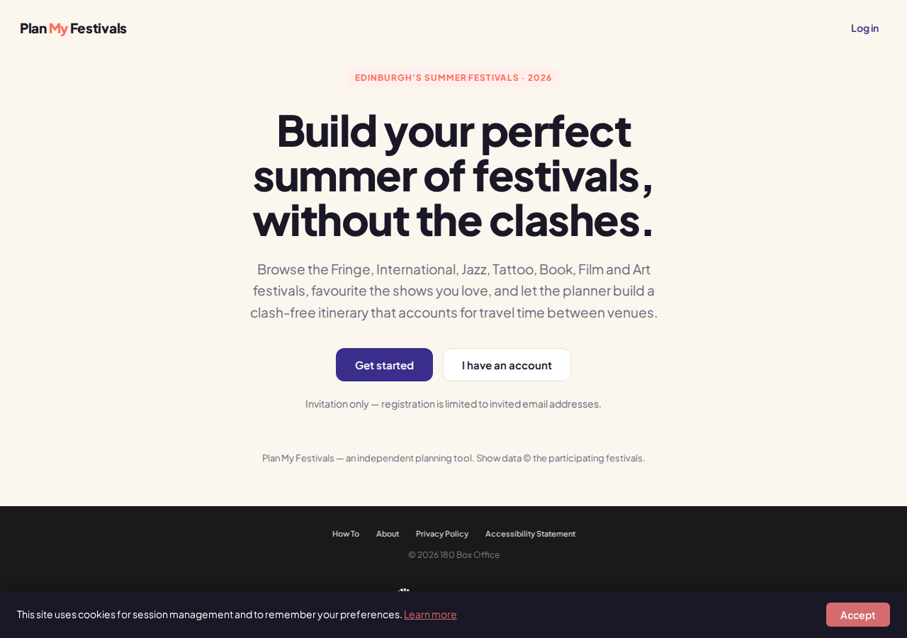

- **Pitch, verbatim from the landing page**: "Build your perfect summer of
  festivals, without the clashes. Browse the Fringe, International, Jazz,
  Tattoo, Book, Film and Art festivals, favourite the shows you love, and let
  the planner build a clash-free itinerary that accounts for travel time
  between venues."
- **The flow** (per the guide): a three-step wizard — plan rules, choose
  shows, build. Rules include dates as **either specific days or "the whole
  summer"** (any date across July and August; the planner then asks whether to
  *spread* shows or **"concentrate them into as few days as possible"** — see
  *Where the gaps are*: that is the planner choosing your days), one of
  **four travel modes** (walking / public transport / driving / cycling)
  driving venue-to-venue travel calculations with a stated **ten-minute
  buffer on every journey**, and **"existing bookings and engagements"** —
  fixed commitments (a dinner, a meeting) the planner locks and schedules
  around, with travel time before and after.
- **Choosing shows** is in-app hearts over a catalogue its own pagination
  counted at **"4,296 shows" across 179 pages** (guide screenshot), filterable
  by festival (all seven), genre, age, venue and free/paid — no edfringe
  favourites import; its favourites live inside the walled account.
- **The built plan** is a day-by-day timeline with per-leg travel arithmetic
  ("twenty-one minutes travel and one hundred and forty-nine minutes free"),
  an **unscheduled-shows panel** naming each show that would not fit with
  every date it is actually performing — click one and the site offers to
  **widen the plan** to a new day — and a **gap finder**: wherever the plan
  leaves the user idle, a "Find a show" button lists everything that could
  physically fit, with **shows at the venue you are already sitting in
  promoted first ("same venue, starting soon")**, and one-click adds tagged
  "lucky dip". That is the Now page's reachability concept, executed at plan
  time.

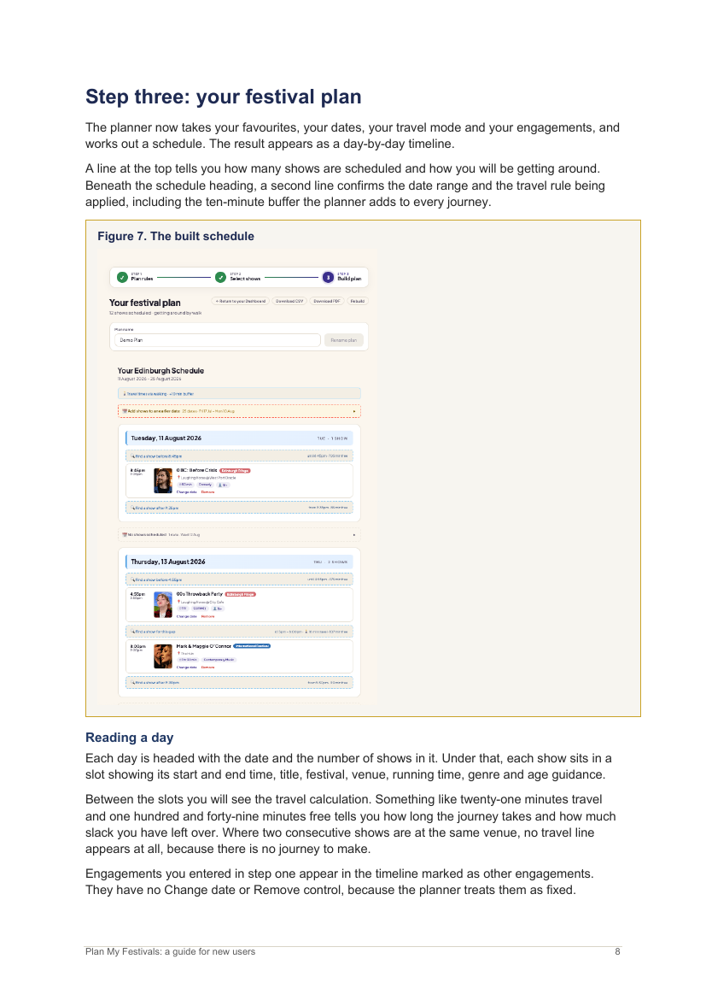
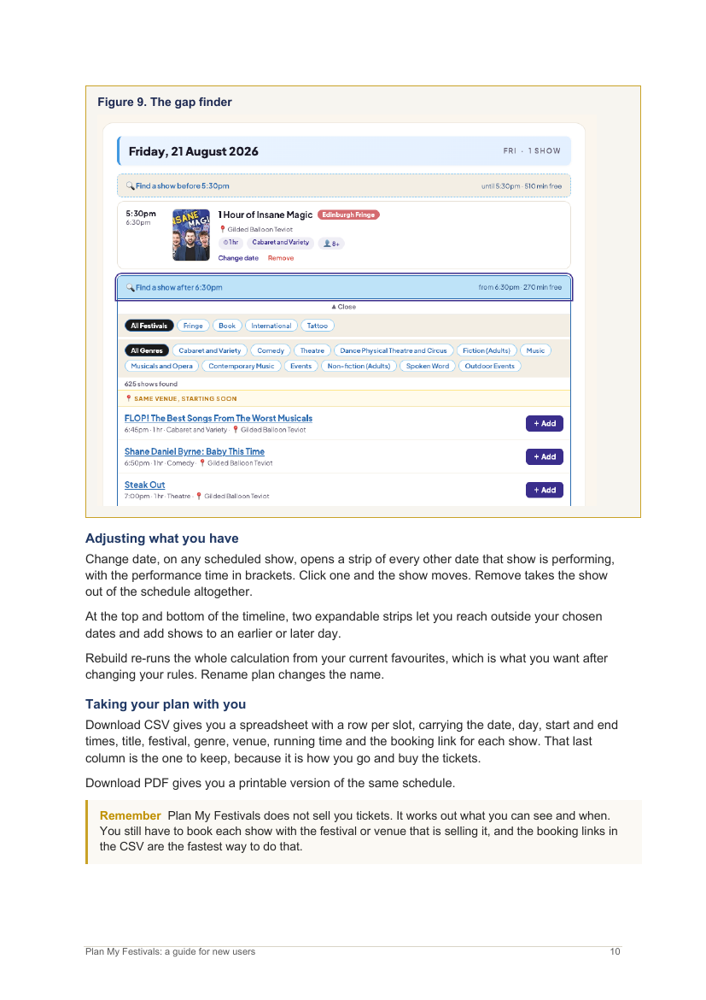

- **Outputs**: CSV (a row per slot **with the booking link per show**) and
  PDF. It sells nothing — "You still have to book each show with the festival
  or venue that is selling it."
- **A venue map** with clustering and per-venue accessibility and facilities
  detail (step-free access, accessible toilets, babychange, café, bike
  parking).
- **The gate**: **"Invitation only — registration is limited to invited email
  addresses"**, and registration collects a postcode "to understand where you
  are travelling from". So its user base is deliberately capped, and nothing
  public reveals its size.
- **The money**: a **producer side**. Producers request access, hold a bank of
  paid **impressions**, and run campaigns that place their shows in the
  featured carousel at the top of the chooser, with per-campaign
  favourite-conversion tracking. The first paid-placement monetisation seen
  anywhere in this field — the exact model Plan Your Fringe's "no show can
  pay to be in your plan" pledge defines itself against. No prices published.
- **Who runs it**: the footer says "© 2026 **180 Box Office**" and "Show data
  © the participating festivals". A Companies House search for "180 Box
  Office" returns **no results** (2026-09-01) — a trading name, or a non-UK
  entity; unresolved.
- **Where the data comes from** (inference, marked as such): the festival set
  (Fringe + International + Jazz + Tattoo + Book + Film + Art), the genre
  vocabulary visible in its UI ("Fiction (Adults)", "Dance, Physical Theatre
  and Circus", "Cabaret and Variety"), the per-venue accessibility prose, and
  the "Show data © the participating festivals" attribution line all match
  the [Edinburgh Festivals Listings API](https://api.edinburghfestivalcity.com/documentation/events)'s
  coverage, taxonomy and licence terms — consistent with it being an
  **approved Listings API consumer**, which would be existence proof that the
  API's approval path is open to planner-shaped products (the question
  [edinburgh-fringe-ticketing/](../edinburgh-fringe-ticketing/README.md) carries). Unconfirmed;
  no availability signal appears anywhere in its UI, which also fits an
  availability-blind source.

- **[Data Thistle](https://edinburghfestival.datathistle.com/)** — combined
  listings across the Fringe, International, Book, Jazz, Tattoo, Art, Film, Free
  Fringe, Free Festival and Fringe by the Sea, plus a commercial events API. A
  listings directory rather than a planner: no reachability, no itinerary, no
  favourites. The closest thing found to a multi-festival competitor.
- The **[Edinburgh Festivals Listings API](https://api.edinburghfestivalcity.com/projects)**
  publishes a gallery of 13 apps built on it — Plan My Fringe, FringeFlow,
  TicketBadger, Frindr, myFestival, Festival Clock, Fringe Vibes and others.
  The data covers all 11 festivals; almost every app on it is named and framed
  around the **Fringe alone**. Nobody in the gallery claims cross-festival
  planning.

Two caveats on how strong the gallery evidence reads. The blurbs are
self-reported and possibly stale, and a cross-festival tool would not
necessarily be *listed* there — planmyfestivals itself is not, which is the
proof. (Superseded 2026-09-01: this paragraph used to close "treat 'the
cross-festival claim is unclaimed' as the current best reading" — the
planmyfestivals user guide settles it the other way, and the sentence is
corrected rather than deleted so the change of position stays visible.)

## The field beyond Edinburgh (empty, and verified empty)

Researched 2026-09-01, festival by festival, for the widened product direction.
The finding is stark: **outside Edinburgh, the third-party festival-planner
category does not exist.** Searches for an Adelaide Fringe or Brighton Fringe
planner return *Edinburgh's* Plan My Fringe as the top hits; nothing third-party
was found for [Melbourne International Comedy Festival](https://www.comedyfestival.com.au/2026-program-guide/)
(750+ shows), [Just For Laughs Montreal](https://www.mtl.org/en/experience/just-for-laughs-festival),
[Netflix Is A Joke](https://www.hollywoodreporter.com/tv/tv-news/netflix-is-a-joke-festival-2026-lineup-schedule-los-angeles-1236478031/)
(475+ shows across 35 LA venues, per The Hollywood Reporter — and no official
app either), [SF Sketchfest](https://sfsketchfest2026.sched.com/), or SXSW's
official programme. Where planning tooling exists at all, it is official or
rented SaaS:

- **[Sched](https://sfsketchfest2026.sched.com/)** — SF Sketchfest outsources
  its schedule to a generic event-SaaS instance (personal schedules, calendar
  sync).
- **[SXSW GO](https://www.eventbase.com/sxsw-go)** — the official app, built on
  Eventbase; schedule building and networking, with a documented gap (no
  custom/unofficial events) that a third-party ecosystem fills only for
  *parties*, via [Do512](https://2025.do512.com/) and
  [RSVPATX](https://rsvpatx.com/rsvp-list) RSVP aggregators.
- **[Adelaide Fringe's official app](https://adelaidefringe.com.au/our-app)**
  (built by Katalyst) plus an on-site
  ["My plan" web planner](https://adelaidefringe.com.au/my-fringe/plan) —
  wishlist and sort-by-day, the closest official analogue to `/plan` found
  anywhere.
- **[Brighton Fringe's official app](https://www.dabapps.com/work/clients/brighton-fringe-app/)**
  (built by agency DabApps, buying tickets through the festival's own APIs).
- **MICF has no current official app found at all** — the only trace is a
  [2010-era iPhone app](https://itwire.com/software/laugh-it-up-on-the-iphone-melbourne-international-comedy-festival-app.html).

Precision added 2026-09-01 (film pass): the emptiness claim is about *comedy*
festivals. In **film**, exactly one live third-party specimen was found —
[tiffr](https://2026.tiffr.com/), an unofficial TIFF-only planner rebuilt per
year — and the strongest official planner anywhere is
[Berlinale's "My Festival Planner"](https://www.berlinale.de/en/programme/festival-planner.html)
(favourites → schedule → iCal). One tool for one festival, in the whole film
circuit: the category is thin there too, not absent. Details on
[festival-circuits/](../festival-circuits/README.md)'s film
adjacency section.

The structural analogue where the category *is* proven: **music festivals.**
[Clashfinder](https://clashfinder.com/) is the closest cousin to what a
generalized EdFringeNow would be — free, crowdsourced lineup-clash grids for
hundreds of festivals, personal act highlighting, and **JSON, XML and iCalendar
export**; it already hosts a few tiny UK comedy events
([Exeter Comedy Festival](https://clashfinder.com/s/ecf26/),
[Cambridge Fringe](https://clashfinder.com/m/cambridgefringe2025/)) but has
no Edinburgh Fringe grid — plausibly because a 3,000-show open-access festival
exceeds what a hand-edited grid can carry. Around it sit a dozen consumer
set-time apps ([Festival Dust](https://www.festivaldust.com/),
[Headliners](https://apps.apple.com/us/app/headliners-festival-planner/id6478820193),
[Frontstage](https://www.frontstagefestivals.com/app), …), the organizer-side
platform [Woov](https://woov.com/) (600+ partner festivals, B2B), and
[Songkick's festivals directory and public API](https://www.songkick.com/developer)
— the machine-readable festival dataset comedy entirely lacks. The read for the
product: the planning-demand shape is proven at scale in music, unserved in
comedy, and first-in-category open everywhere except Edinburgh.

## Feature comparison

Compiled 2026-09-01. Every cell is the tool's own claim or a first-hand
observation, traceable to that tool's entry above and the screenshots below;
**none of these tools has been stress-tested end to end**, so this table
compares what each *claims and shows*, not measured behaviour. "—" = not
claimed anywhere we can see; "?" = unknowable from outside (login/invite
walls). Our own two rows come from the shipped product
([`docs/product-spec.md`](https://github.com/missingbulb/EdFringeNow/blob/main/docs/product-spec.md),
[`plan/README.md`](https://github.com/missingbulb/EdFringeNow/blob/main/plan/README.md))
so the comparison has its reference points.

| Tool | Scope | Intake | Dates | Clash engine & travel | Meals / commitments | Availability | Gap-filling / nearby | Exports & handoff | Gate & funding |
|---|---|---|---|---|---|---|---|---|---|
| **EdFringeNow `/plan`** | Fringe | edfringe favourites CSV (third-party extension) | **scores best dates** in a window | ✓ travel legs per mode | — | sold-out overlay (a decaying forecast) | — | CSV, ICS | none; free; travel partner links (disclosed commission) |
| **EdFringeNow Now page** | Fringe | none — zero-input | today | ✓ live slack vs **next commitment**, per mode | the commitment *is* the input | ✓ live sold-out / started | ✓ the whole product | — | none; free; travel partner links (disclosed commission) |
| Official Fringe app | Fringe | native favourites (My Planner) | input | — (list + calendar, no engine) | — | booking-integrated | Nearby now: proximity + starting soon | calendar sync, QR tickets, offline | free |
| Plan My Fringe | Fringe | in-app wishlist + ratings | input | ✓ walking speed, per-day max, min gap | ✓ meal + sleep minimums | — | Fringe Trail (walk-minimising); a NEARBY tab on the site | animated Google-Maps trail; web+app shared state | free; donations; iOS + Android |
| **planmyfestivals** | **7 festivals** | in-app hearts | input, **or whole-summer — the planner picks the days** | ✓ 4 modes, 10-min buffer | ✓ locked engagements | — | ✓ plan-time gap finder, same-venue-first | CSV with booking links, PDF | **invite-only; producer-paid placement** |
| FringePlan | Fringe | paste link / name / whole list | input (+ arrival/departure) | ✓ travel + priorities | ✓ meals | ✓ availability colours; stale-plan flags | — | share link, **live iCal**, markdown, edfringe basket | free |
| Plan Your Fringe (+ FringePal) | Fringe | taste wizard | input | builds day-by-day | — | — | live "near me now" **teased** | PDF by email | free; email-gated; no-pay-to-play pledge |
| Fringe Finder | Fringe | AI concierge chat | input | walking times in day builds | — | ✓ plans around what's still on sale | concierge-built days | — | free; "official pilot" (asserted) |
| edfringeplanner | Fringe | edfringe favourites (mechanism unknown) | input | preference-weighted scheduling | ? | ? | ? | ? | login-walled |
| edfringemap | Fringe | — (browse) | day filter | — | — | — | — | out-links to booking | free; EN + 4 languages; promoted slots £99–£749 + sponsor tiers |
| Data Thistle | 10 festivals | — | — | — | — | — | — | — | directory + paid API |

Three readings the grid supports: the **live column belongs to one row** (ours
— everything else is plan-time or a tease); the **cross-festival column
belongs to one row** (planmyfestivals — invite-gated); and **no tool holds
both** date-scoring and cross-festival scope, or either together with live
reachability.

### The UI record

Captured 2026-09-01 (headless Chromium at 1280×900, network served through
this environment's proxy via curl; planmyfestivals' app screens are its own
guide's figures, since registration is invite-only). Full set in
[`sample-data/competitor-ui/`](../sample-data/competitor-ui/) with a
provenance README; the most comparison-relevant:

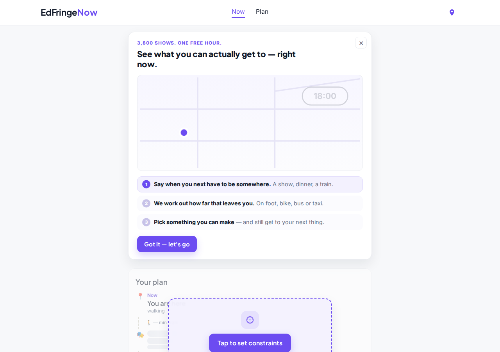 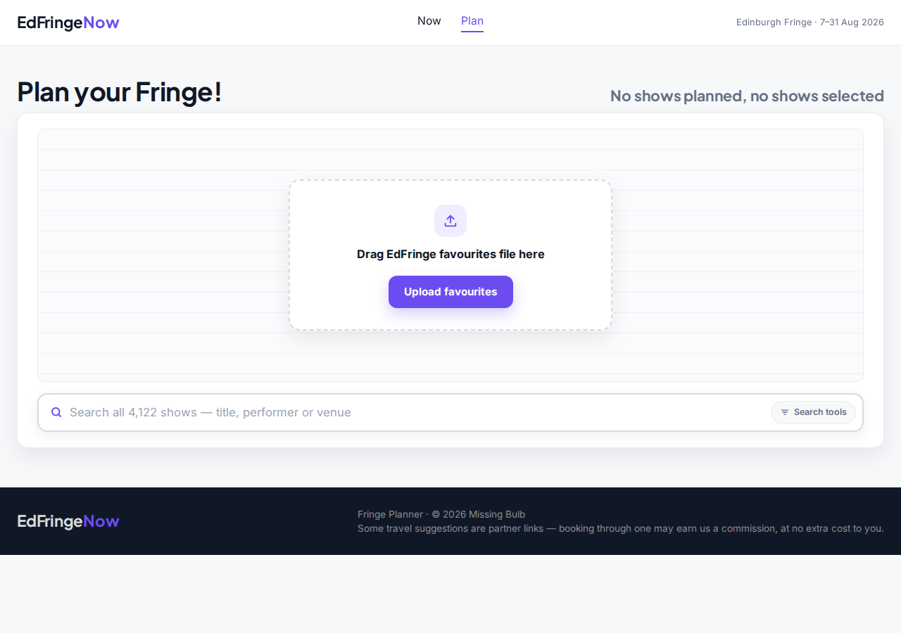
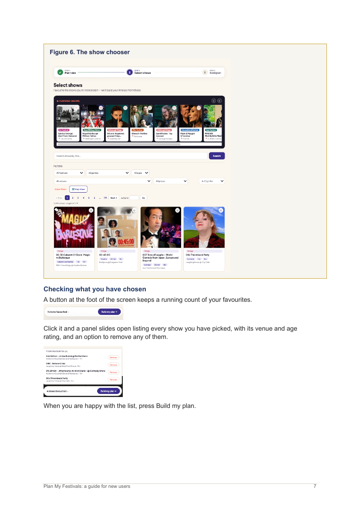 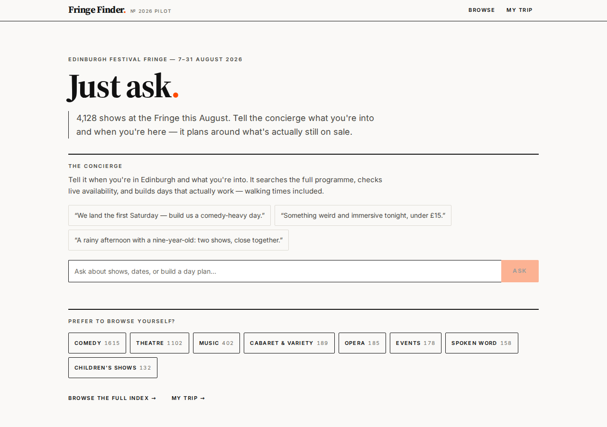
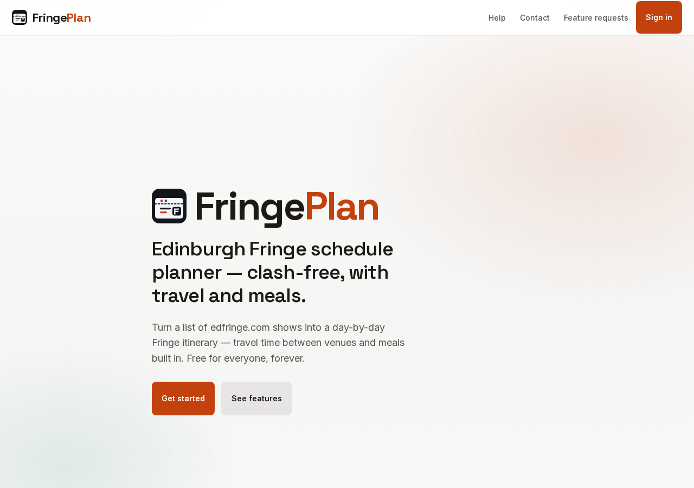 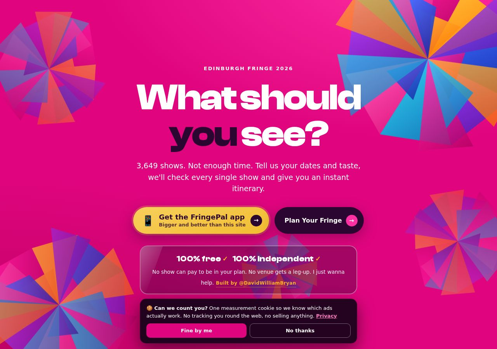
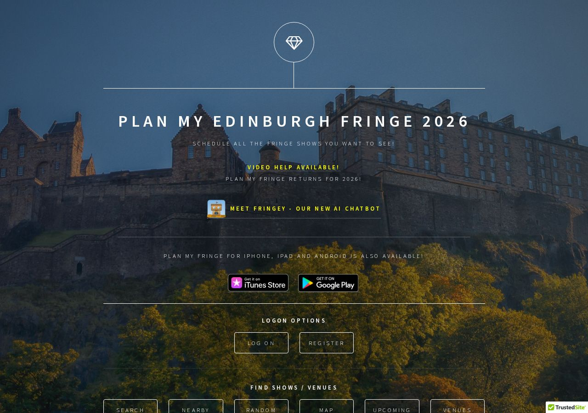 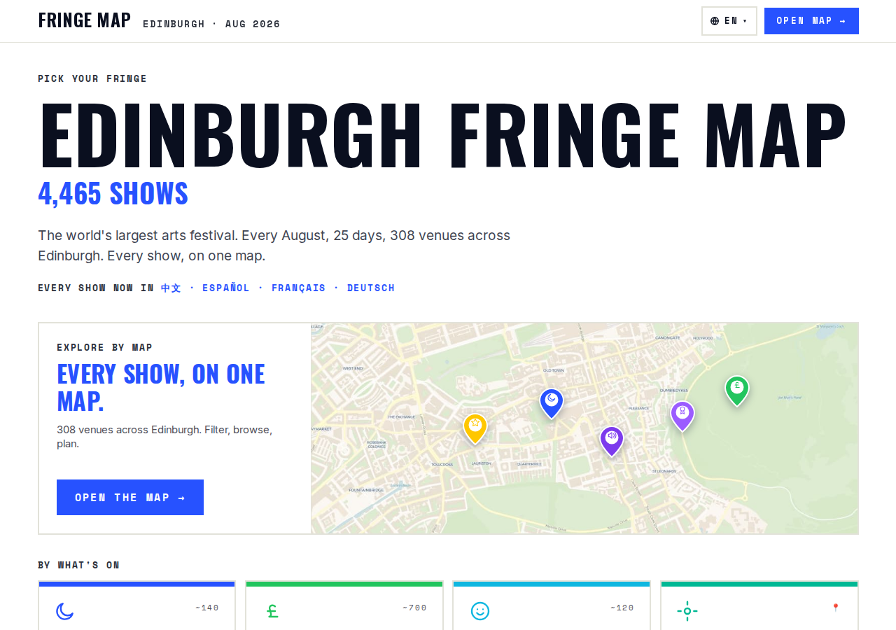

## How the rivals make money

Asked three ways on the owner's direction — local sponsorship? affiliate /
rev-share to hotel, flight or restaurant booking? display ads? — and answered
empirically (2026-09-01): every rival's first-hand-fetched pages and
JavaScript bundles were fingerprint-searched for ad networks
(AdSense/DoubleClick/Carbon), affiliate networks and booking-site parameters
(AWIN, CJ, booking.com, Expedia, Skyscanner, GetYourGuide, Viator, Amazon),
and donation platforms (Ko-fi, BuyMeACoffee, Patreon), and each tool's own
commercial pages were read where they exist. Two false-positive classes were
discarded (minified `_drawing` matching "awin"; React's `onDoubleClick`).

**Paid placement — two rivals, two implementations:**

- **edfringemap is the most commercially developed tool in the field**, and
  publishes its whole model. A
  [posted rate card for promoted show slots](https://edfringemap.com/advertise):
  "Genre Featured" from **£99 for a whole run** (five slots per genre, price
  stepping £99→£149→£199→£249→£299 as slots fill), "Featured in a Moment"
  (Tonight / Free / Family / Late Night / Under £10 / Award Winners) at
  **£249** with eligibility "check[ed] in code, not on trust", and
  "Spotlight" at **£749** (ten slots festival-wide) — paid by Stripe, live in
  minutes, "money never reorders the ordinary results", pitched as "less
  than you pay one flyerer for one day". Beside it, a
  [sponsorship page](https://edfringemap.com/sponsor) with three
  enquiry-priced tiers: **presenting sponsor** ("Fringe Map, presented by
  you"), **category/area partner**, and — precisely the local-sponsorship
  lane the owner asked about — **"Bars, food & venues: get your place in
  front of Fringe-goers nearby, right when they're planning their night"**.
  The same page self-describes as "built by two Edinburgh locals" and the
  advertise page states the map runs on **"official festivals API data"**
  with "every show listed free — promotion is optional".
- **planmyfestivals** sells producer **impression campaigns** in its featured
  carousel (profiled above; rates unpublished) — and its footer component
  carries a **"Supported by: VisitScotland"** logo (found in the application
  bundle), i.e. national-tourism-body backing of some unstated kind, the
  only public-body support visible anywhere in the field.

**Donations:** [Plan My Fringe](https://www.planmyfringe.co.uk/) carries a
"Donate" nav item to a DonationBucket page — the volunteer-project model.

**Data sales:** Data Thistle sells its events API (already profiled).

**Explicitly or apparently nothing:** FringePlan ("free for everyone,
forever… no subscriptions, no ticket markups, and no hidden fees" — and its
pages are fingerprint-clean); Ed Fringe Guide (fan-made, a gmail contact —
and a correction: **edfringeguide.com and anotherfringeguide.com serve
byte-identical pages** — the "two" unofficial guides this page has listed
since July are one site on two domains); edfringeplanner (nothing visible
outside the login); Fringe Finder (fingerprint-clean — if it is the official
pilot it asserts, its funding may be the Society's, unconfirmed). Plan Your
Fringe is free with a no-pay-to-play pledge and monetises indirectly if at
all: it *buys* ads (its cookie banner: "one measurement cookie so we know
which ads actually work") and routes users to its FringePal app, whose model
is unexamined.

**The two empty lanes, and who is in them:** across every rival, **zero
display-ad fingerprints and zero travel-booking affiliate fingerprints** —
nobody serves ads, and nobody earns on hotels, flights or restaurants. The
one product in the field with travel affiliate revenue is **ours**: the
shipped footer discloses "Booking links on plans (tables, trains, stays,
tours) may earn us a small commission"
([`index.html`](https://github.com/missingbulb/EdFringeNow/blob/main/index.html),
with configured affiliate IDs exercised by
[`js/places.js`](https://github.com/missingbulb/EdFringeNow/blob/main/js/places.js)'s
partner links). Worth holding beside
[edinburgh-fringe-ticketing/](../edinburgh-fringe-ticketing/README.md)'s finding that
**ticket-side** commission is structurally impossible at the Fringe — the
non-ticket affiliate lane is the only affiliate lane there is, and no rival
has entered it.

## Where the gaps are

**Live reachability — still open, and no longer unnoticed.** No tool centres
full reachability: location _plus_ travel mode/time _plus_ next-commitment slack
("can I see this and still make my 7pm?"). The official app's "Nearby now"
remains the nearest neighbour and stops at proximity + starting-soon; Plan My
Fringe models walking time, but for a pre-curated plan. That live calculation is
still Fringe Discover's distinct position — see the product brief
(`docs/product-spec.md`). Two 2026-09-01 signals that the position is being
approached from the planning side: Fringe Finder's concierge pitches days
"that actually work — walking times included", and Plan Your Fringe's
early-access pitch names **live "near me now"** as a feature it is building.
Neither is shipped live reachability; both are competitors walking toward it.

**Planning — crowded, and the moat is narrower than it looks.** Clash-free,
travel-aware, meal-break-aware scheduling with per-day limits is **table stakes**
on this side of the field: Plan My Fringe has shipped all of it for years, and
2026 added at least three more itinerary builders.

**Correction (2026-08-09) — the favourites-intake claim is taken.** This page
previously asserted that *no* profiled competitor starts from the user's
existing favourites list, and rested half of `/plan`'s remaining distinctness on
it. That is no longer supportable:
[edfringeplanner.co.uk](https://edfringeplanner.co.uk/) advertises precisely
that as its whole premise ("takes your favourites from edfringe.com"), and
[FringePlan](https://fringeplan.com/) accepts a whole pasted list in one go and
pushes a finished day back into an edfringe.com basket. The claim is left here
rather than deleted so the change of position is visible. What *survives* of it
is narrower and worth stating precisely: nobody was found taking the specific
**CSV produced by the third-party favourites extension**, and no competitor
documents where its favourites come from — so whether these tools use a native
export, the same extension, or a logged-in scrape is unknown, and that is now the
open question rather than the differentiator.

What no profiled competitor still does — a list that shrank twice in one day:

1. answer **"when should I come?"** — scoring date windows across the whole
   festival, the decision a visitor makes *before* any scheduling question
   exists. **Dented 2026-09-01** (was "still unoccupied"): planmyfestivals'
   whole-summer mode takes July–August as a flexible window and — on the
   "concentrate into as few days as possible" setting — **the planner chooses
   which days you attend**. That is date-*selection*. What survives as
   unoccupied is date-*scoring*: recommending and ranking candidate windows
   for a fixed trip length against favourites coverage (and, per
   [edinburgh-market-and-audience/](../edinburgh-market-and-audience/README.md), against
   accommodation) rather than silently emitting one packed answer. Every
   Fringe-only planner re-checked (Plan Your Fringe, Fringe Finder,
   edfringeplanner, FringePlan, Plan My Fringe) still takes dates as an
   input.
2. plan across the **other seven August festivals** — **claimed, 2026-09-01**
   (was "unclaimed", then "contested" earlier the same day): the
   planmyfestivals user guide documents exactly this, shipped, across all
   seven listed festivals. What survives here is narrower: the claim is
   behind an **invitation wall** (its reach is deliberately capped and
   unknown), its catalogue shows no availability signal at all, and Deaf
   Festival / Fringe by the Sea sit outside its seven.

Those were the two pillars a planner-side requirement set was going to rest
on; after today the honest statement is that **the planner side has no
unclaimed pillar left — only under-served versions of claimed ones** (scored
date choice; cross-festival with availability, at open registration). The
live surface's claim is untouched and is a different claim, which is why the
two surfaces should not be reasoned about as one product — see
[audience-divergence/](../audience-divergence/README.md).

## Sources

- [Fringe app — Edinburgh Festival Fringe](https://www.edfringe.com/experience/plan-your-visit/fringe-app/)
- [Edfringe on the App Store](https://apps.apple.com/gb/app/edfringe/id6450713971)
- [How the Edinburgh Fringe app works — including nearby event finder (The Scotsman)](https://www.scotsman.com/arts-and-culture/edinburgh-festivals/edinburgh-festival-fringe-app-4214702)
- [Edinburgh Fringe Festival app case study (equ)](https://equ.com.au/work/edinburgh-fringe-festival/)
- [Plan My Fringe — Edinburgh Fringe Scheduler](https://www.planmyfringe.co.uk/)
- [Plan My Fringe — Help](https://www.planmyfringe.co.uk/Help.aspx)
- [Plan My Fringe on the App Store](https://apps.apple.com/gb/app/plan-my-fringe/id1264802429)
- [Plan Your Fringe](https://planyourfringe.com/)
- [Fringe Finder — Edinburgh Fringe 2026 planner](https://fringe-finder.netlify.app/)
- [Fringe Planner 2026 — interactive map (edfringemap.com)](https://edfringemap.com/)
- [Ed Fringe Guide — unofficial Edinburgh Fringe show finder 2026](https://edfringeguide.com/index.html)
- [Another Edinburgh Fringe Show Finder](https://www.anotherfringeguide.com/)
- [Edinburgh Fringe Planner](https://edfringeplanner.co.uk/) — "takes your favourites from edfringe.com and helps you work out what to do when."
- [Edinburgh Fringe Planner — sign up](https://edfringeplanner.co.uk/signup)
- [FringePlan — Edinburgh Fringe Planner](https://fringeplan.com/) — clash-free schedule with travel time, meals and priorities; read-only share link, live iCal feed, markdown export, one-go edfringe.com basket, and stale-plan flagging.
- [EdFringe Favourites to CSV (Chrome Web Store)](https://chromewebstore.google.com/detail/edfringe-favourites-to-cs/ebbiecdkhoclnlgfibfhhnpfhmmgdbcc)
- [Edinburgh Festival Fringe (programme)](https://www.edfringe.com/)
- [Half Price Hut — Edinburgh Festival Fringe](https://www.edfringe.com/tickets/half-price-hut)
- [Edinburgh Festival Fringe Box Office](https://www.edfringe.com/experience/plan-your-visit/fringe-box-office/)
- [We've published our review of the year 2025 (edfringe.com)](https://www.edfringe.com/about-us/news-and-blog/weve-published-our-review-of-the-year-2025/)
- [ThreeWeeks (Wikipedia)](https://en.wikipedia.org/wiki/ThreeWeeks)
- [Edinburgh Festival 2026 — combined listings (Data Thistle)](https://edinburghfestival.datathistle.com/)
- [Projects built on the Edinburgh Festivals Listings API](https://api.edinburghfestivalcity.com/projects)
- [FringePlan](https://fringeplan.com/)
- [planmyfestivals.com — Edinburgh Festival Planner 2026](https://www.planmyfestivals.com/) — fetched first-hand 2026-09-01; a Vue SPA with a Leaflet/OpenStreetMap map.
- [planmyfestivals.com application bundle](https://www.planmyfestivals.com/assets/app-BRlWgudd.js) — the 2026-09-01 bundle inspection behind the cross-festival scope finding: Fringe, Tattoo, Book, International, Art and Jazz carried as first-class strings.
- [PlanMyFestivals — a guide for new users (PDF)](https://www.planmyfestivals.com/static/guide/PlanMyFestivals-User-Guide.pdf) — the 15-page vendor user guide behind the full profile above: the three-step wizard, whole-summer vs specific dates, four travel modes and the ten-minute buffer, engagements, the unscheduled-shows panel and plan widening, the gap finder, CSV/PDF exports, the venue map, invitation-only registration, and the producer impression-bank campaigns. Read in full 2026-09-01; key figures archived to [`sample-data/competitor-ui/`](../sample-data/competitor-ui/).
- [Companies House search: "180 box office"](https://find-and-update.company-information.service.gov.uk/search/companies?q=%22180+box+office%22) — no results, 2026-09-01; the operator name in planmyfestivals' footer has no matching UK registration. (The landing-page screenshots behind the UI record are first-hand captures of the tool URLs already listed above — provenance in [`sample-data/competitor-ui/`](../sample-data/competitor-ui/)'s README.)
- [Promote Your Show on Fringe Map (edfringemap.com/advertise)](https://edfringemap.com/advertise) — the posted rate card: Genre Featured £99–£299 stepped over five slots per genre, Featured in a Moment £249, Spotlight £749, Stripe, "money never reorders the ordinary results", "official festivals API data", fetched 2026-09-01.
- [Sponsor the Fringe Map (edfringemap.com/sponsor)](https://edfringemap.com/sponsor) — the three enquiry-priced sponsorship tiers, including the local "bars, food & venues" tier; "built by two Edinburgh locals"; fetched 2026-09-01.
- [Plan My Fringe — DonationBucket](https://www.planmyfringe.co.uk/DonationBucket) — the Donate page its site nav links; fetched 2026-09-01 via the homepage nav.
- [EdFringeNow's own footer disclosure (`index.html`)](https://github.com/missingbulb/EdFringeNow/blob/main/index.html) — "Booking links on plans (tables, trains, stays, tours) may earn us a small commission" — the reference point for the affiliate-lane comparison.
- [FringePal](https://fringepal.com/) — the companion app Plan Your Fringe promotes ("bigger and better than this site"); unexamined.
- [Netflix Is A Joke Fest 2026 lineup and schedule (The Hollywood Reporter)](https://www.hollywoodreporter.com/tv/tv-news/netflix-is-a-joke-festival-2026-lineup-schedule-los-angeles-1236478031/) — 475+ shows across 35 LA venues; no planner, no official app found.
- [MICF 2026 program guide (comedyfestival.com.au)](https://www.comedyfestival.com.au/2026-program-guide/) — the 750+ show count behind the beyond-Edinburgh comparison.
- [SF Sketchfest 2026 on Sched](https://sfsketchfest2026.sched.com/) — planning outsourced to generic event-SaaS.
- [SXSW GO, built on Eventbase](https://www.eventbase.com/sxsw-go) — the official-app planner model.
- [Adelaide Fringe official app](https://adelaidefringe.com.au/our-app) and [My plan web planner](https://adelaidefringe.com.au/my-fringe/plan) — the closest official analogue to `/plan` found anywhere.
- [Brighton Fringe app case study (DabApps)](https://www.dabapps.com/work/clients/brighton-fringe-app/)
- [Clashfinder](https://clashfinder.com/) — crowdsourced music-festival clash grids with JSON/XML/iCal export; hosts [Exeter Comedy Festival](https://clashfinder.com/s/ecf26/) and [Cambridge Fringe](https://clashfinder.com/m/cambridgefringe2025/) grids, but no Edinburgh Fringe.
- [Woov](https://woov.com/) — organizer-side festival-companion platform, 600+ partner festivals.
- [Songkick developer API](https://www.songkick.com/developer) — the machine-readable festivals dataset music has and comedy lacks.
- [Festival Dust](https://www.festivaldust.com/) — representative of the consumer set-time app field (with [Headliners](https://apps.apple.com/us/app/headliners-festival-planner/id6478820193), [Frontstage](https://www.frontstagefestivals.com/app) and others).
- [Do512's SXSW hub](https://2025.do512.com/) and [RSVPATX](https://rsvpatx.com/rsvp-list) — the unofficial-party aggregators around SXSW's official programme.

## Open questions

- **No 2026 entrant has been driven end to end.** Narrowed 2026-09-01, in the
  right direction at last: the egress proxy that blocked every rival's own site
  on the 2026-08-09 pass no longer does, and fringe-finder.netlify.app,
  edfringeplanner.co.uk, fringeplan.com, planyourfringe.com and
  planmyfestivals.com were all fetched **first-hand** this pass — so the
  profiles above now rest on the tools' own pages rather than a search engine's
  memory of them. Narrowed again the same day for one tool: planmyfestivals'
  **published user guide documents its entire UI** (twelve figures,
  screenshotted into `sample-data/`), which is the next best thing to driving
  it — and driving it is now the one thing this wiki *cannot* do, because
  registration is invitation-only. What remains open for the rest is *use*:
  nobody here has pasted a list into FringePlan, generated a Plan Your Fringe
  itinerary, or logged into edfringeplanner.
- **Does the Fringe Society confirm Fringe Finder's "official pilot"?** Its own
  page asserts "an official pilot with the Edinburgh Festival Fringe"
  (verified on-page 2026-09-01) — no confirmation found from the Society's
  side, and an official pilot on the planning side would change the
  competitive read. Related: what feeds its availability tracking and walking
  times — the Listings API (availability-blind, so presumably not), a
  Tikketr scrape like ours, or something granted by the pilot?
- **Does the shipped 2026 official app add travel-time or next-commitment logic
  to "Nearby now"?** Published descriptions still say proximity + starting soon,
  but nobody here has used the 2026 build. (Narrowed 2026-07-28 from "unknown" to
  "no published evidence of it".)
- **Does any tool expose real-time started / sold-out status** the way Fringe
  Discover's live status does? Two now claim the ingredients: Fringe Finder
  plans around "what's actually still on sale" and says listings refresh
  "several times a day"; FringePlan pulls availability colours (confirmed
  2026-09-01, above). How live either is, and what each reads it from, is
  unconfirmed.
- ~~**Does Plan My Fringe (or any planner) accept a favourites import?**~~
  **Answered 2026-08-09: yes — not Plan My Fringe, but edfringeplanner.co.uk,
  whose entire premise is it.** `/plan`'s intake advantage is gone. See the
  correction under *Where the gaps are*.
- **Where do these tools get the favourites from?** The successor question, and
  the one that decides whether anything is left of the intake position. No
  competitor documents the mechanism — native edfringe.com export, the
  third-party CSV extension, or a logged-in scrape are all consistent with what
  they say. If there is a native export nobody here has found, the
  edinburgh-market-and-audience page's intake assumption is wrong too.
- ~~**Does FringePlan's "flag a delisted show or moved performance" mean it holds
  live availability?**~~ **Answered 2026-09-01: yes.** Its own homepage states
  that adding shows pulls in "ticket availability colours … automatically" —
  so Fringe Finder is not the only tool on the availability axis. How fresh
  those colours are, and where they come from, is the successor question.
- **FringePal is unexamined.** Plan Your Fringe now routes visitors to a
  companion app it calls "bigger and better than this site"; nothing else is
  known about it.
- **Is the beyond-Edinburgh planner vacuum demand-side or supply-side?** No
  third-party planner exists for MICF, Netflix Is A Joke, Adelaide or Brighton
  — but whether that is because official apps suffice, because those festivals'
  showcase shapes don't create the clash problem, or because nobody has built
  one yet is exactly the question the product direction turns on. Adelaide's
  official "My plan" (wishlist + sort-by-day) is the strongest evidence that at
  least the demand for *some* planning exists at open-access scale.
- **Why is there no Edinburgh Fringe Clashfinder?** The crowdsourced-grid model
  covers hundreds of music festivals and even two tiny UK comedy events, but
  stops short of the 3,000-show open-access scale. If the reason is editorial
  (hand-edited grids don't scale), that is evidence the Fringe-scale planning
  problem needs generated data, not crowdsourcing — our architecture.
- **Does anything else score date windows** ("when should I come?")?
  Re-narrowed 2026-09-01: planmyfestivals now *selects* days (whole-summer
  mode, concentrate-or-spread — see *Where the gaps are*), so the question is
  no longer "does anyone touch date choice" but "does anyone **score and
  recommend** windows rather than silently emitting one packed answer". On
  that narrower question: still nobody found.
- ~~**Is anything actually planning across festivals?**~~ **Answered
  2026-09-01: yes — planmyfestivals**, whose user guide documents clash-free
  cross-festival itineraries with travel modes, engagements and a gap finder
  (see its profile above). The morning's "one confirmed carrier, depth
  unknown" hedge lasted a few hours. The Listings API gallery still shows
  nothing cross-festival and Data Thistle still lists everything and plans
  nothing — the field is planmyfestivals alone.
- **Who or what is "180 Box Office"?** planmyfestivals' footer credit. A
  Companies House search returns no such company (2026-09-01) — trading name,
  non-UK entity, or something else. Whoever it is decided to build the
  cross-festival planner invite-first and producer-funded; knowing them would
  answer how seriously to take its rollout.
- **Is planmyfestivals an approved Listings API consumer?** Its festival set,
  genre vocabulary, venue-facilities detail and "Show data © the
  participating festivals" credit all match the API's schema and licence
  shape (see the profile above — an inference, not a finding). If confirmed,
  it is existence proof that the API approves planner-shaped products, which
  bears directly on [edinburgh-fringe-ticketing/](../edinburgh-fringe-ticketing/README.md)'s
  "would they approve us" question.
- **How big is planmyfestivals' user base?** Invitation-only registration
  caps it deliberately; nothing public says at what size, or when (or
  whether) it opens.
- **What do planmyfestivals producer campaigns cost?** The guide documents
  the impression-bank mechanics but no prices — unlike edfringemap, whose
  rates are posted, this paid-placement model runs with unpublished rates.
- **What is VisitScotland's relationship to planmyfestivals?** Its bundle
  footer says "Supported by: VisitScotland" — a grant, a marketing
  partnership, or something looser. The only public-body backing visible in
  the field, and unexplained.
- **Does edfringemap's rate card actually sell?** The prices and slot caps
  are posted (five per genre, eight per moment, ten spotlights) but nothing
  public says how many slots sold in 2026 — the field's only visible revenue
  experiment, results unknown.
- **Does Plan Your Fringe's stale catalogue miss late-registered shows?** It
  advertises checking "every single show" while its counter still reads
  3,649 — the 4 June launch snapshot, ~15% short of the delivered programme.
  If the catalogue really is frozen at launch, its itineraries silently
  exclude every show registered after early June — worth one re-check next
  season as a data-freshness case study in this field.
- **Does Data Thistle's events API compete with us or supply us?** It is a paid
  feed over the same listings the free official API already gives away; what it
  adds is unexamined.
- "FRiNGE.Travel" surfaced in an earlier sweep and was never examined.
- What do users actually do in the "free hour" moment today — official app,
  posters, ask a friend? Still no cited behavioural source (the same gap is
  recorded on the edinburgh-market-and-audience page).

## Growth log

- **2026-07-22** — initial seed: profiled the official app (Nearby now / shake to
  search), Plan My Fringe (schedule optimiser + Fringe Trail), edfringe.com, the
  Half Price Hut, and reviews; framed the reachability gap. Sources cited.
- **2026-07-28** — reframed the page around both product surfaces after taking
  `/plan` into account, and split "where the gap is" into a live gap and a
  planning gap. Added the 2026 planner-side entrants (Plan Your Fringe, Fringe
  Finder, edfringemap.com, Ed Fringe Guide, Another Fringe Guide, Edinburgh
  Fringe Planner); expanded Plan My Fringe's current feature list (budget,
  walking speed, per-day max, minimum gap, minimum lunch/dinner/sleep, AI
  recommendations) and recorded that it neither imports favourites nor chooses
  dates; recorded the official app's My Planner / calendar sync / offline mode
  and its 200k+ downloads; noted the third-party favourites-CSV extension and the
  Half Price Hut's 2026 opening date. Narrowed the "2026 app Nearby now" open
  question rather than closing it. Requirements implication (planner-side
  requirements resting on favourites-intake and date-choice, not on scheduling)
  left for human review.
- **2026-07-29** — added the page's `## Key insights` header: seven terse lines
  distilled from what the page already says (the live-reachability gap, the
  official app's planning strength, scheduling as table stakes, the two
  unclaimed claims, the availability axis, in-person supply, the verification
  gap). Header only: no claim, citation or open question changed.
- **2026-07-31** — added the cross-festival field, found while researching the
  other Edinburgh festivals: Data Thistle (combined listings across ten
  festivals plus a paid events API — a directory, not a planner) and the
  official Listings API's gallery of 13 apps, almost all Fringe-only despite the
  data covering all 11 festivals. Recorded the evidence's weakness (self-reported
  blurbs, possibly stale, not exhaustive) rather than claiming the field empty.
  Key insight 4 rewritten from two unclaimed claims to three — the other seven
  August festivals joins favourites-import and date-choice. Two open questions
  added. Requirements implication left for human review — see the
  edinburgh-festival-season page and the multi-festival design proposal.
- **2026-08-09** — worked the page's top open question (hands-on verification of
  the 2026 entrants) and it cost the page a claim. Examined the two planners left
  unexamined: **edfringeplanner.co.uk**, whose stated premise is taking the
  user's edfringe.com favourites, and **FringePlan** (fringeplan.com), new to
  this wiki — travel-time-, meal- and priority-aware scheduling plus a live iCal
  feed, markdown export, share links, a one-go edfringe.com basket handoff, and
  plans that flag delisted or moved performances. Together they supersede this
  page's "no profiled competitor starts from the user's existing favourites list"
  claim, which is corrected in place with the reason kept rather than deleted;
  what survives of it is narrowed to the unknown *mechanism* of their import.
  Re-checked the date-choice claim across five planners and it held — every one
  takes dates as an input — so that question is narrowed, not closed. Key
  insights 3 and 4 rewritten; insight 4 goes from three unclaimed claims to two.
  Recorded honestly that all four target sites were blocked by the network
  egress proxy this pass and were read second-hand via search-engine indexing of
  their own pages, which makes the verification gap worse, not better. Two open
  questions added (favourites mechanism; whether FringePlan's stale-plan flagging
  implies live availability). Requirements implication — a planner-side
  requirement set can no longer rest on favourites intake, leaving date-choice
  and cross-festival — left for human review.
- **2026-08-02** — spot-checked the "is anything planning across festivals"
  open question with a fresh web sweep: found two 2026 entrants not previously
  profiled, FringePlan (a Fringe-only day planner, close to Plan My Fringe /
  Plan Your Fringe) and planmyfestivals.com, whose plural naming is the first
  candidate found whose own branding suggests cross-festival scope — added both
  to the 2026 planner-side field with the caveat that neither was fetched or
  examined hands-on, so planmyfestivals.com's actual scope stays an open
  question rather than a finding. Header unchanged: neither addition changes the
  page's top-line read (planning side crowded and Fringe-only; cross-festival
  field still effectively empty until verified otherwise).
- **2026-09-01** — the egress block that had forced every rival profile to be
  read second-hand lifted, and this pass fetched all five outstanding sites
  first-hand (fringe-finder.netlify.app, edfringeplanner.co.uk, fringeplan.com,
  planyourfringe.com, planmyfestivals.com). Yield: planmyfestivals.com's scope
  question **answered** — an Edinburgh cross-festival planner, its bundle
  carrying Tattoo/Book/International/Art/Jazz beside the Fringe — so the
  cross-festival section is retitled from "almost empty" and the "unclaimed"
  claim weakened to "contested"; FringePlan's availability question **answered**
  (it pulls ticket-availability colours automatically); Fringe Finder's
  official-pilot claim verified as asserted on its own page (Society-side
  confirmation still missing) along with walking-time-aware planning and a
  several-times-daily refresh cadence; Plan Your Fringe found to be
  performer-built, email-gated, still checking against the stale 3,649-show
  launch snapshot, promoting a previously unrecorded companion app
  (**FringePal**), and teasing live "near me now" — the first competitor seen
  moving toward the live-reachability axis. Key insights 1, 4, 5 and 7
  rewritten; three open questions answered or narrowed, two added (FringePal;
  what feeds Fringe Finder). Driving the tools end to end is now possible in
  principle and remains undone.
- **2026-09-01** *(second pass, same day)* — added *The field beyond Edinburgh*
  for the widened product direction, from a dedicated research pass: no
  third-party planner exists for any comedy festival outside Edinburgh
  (verified per-festival for MICF, Adelaide, Brighton, JFL Montreal, Netflix
  Is A Joke, SF Sketchfest and SXSW); where planning tooling exists it is
  official or rented SaaS (Sched, Eventbase/SXSW GO, Katalyst/Adelaide,
  DabApps/Brighton), and the crowded music-festival planner category
  (Clashfinder's exportable crowdsourced grids, Woov, the consumer set-time
  apps, Songkick's API) proves the demand shape comedy leaves unserved. Key
  insight 6 (Half Price Hut, unchanged in the body) displaced by the
  empty-category finding to stay inside the seven-bullet cap; intro widened
  beyond Edinburgh; two open questions added (demand-side vs supply-side
  vacuum; why no Fringe-scale Clashfinder). Sibling pages:
  [festival-circuits/](../festival-circuits/README.md) owns the
  festivals themselves.
- **2026-09-01** *(third pass, same day — the owner pointed at planmyfestivals'
  user guide and asked for a fuller feature comparison with UI screenshots)* —
  read the 15-page PlanMyFestivals user guide PDF in full, and it rewrote the
  page's competitive read: planmyfestivals is a complete **cross-festival
  clash-free planner** (three-step wizard; whole-summer or specific dates
  with a spread-vs-concentrate choice; four travel modes with a ten-minute
  buffer; locked engagements; an unscheduled-shows panel with plan-widening;
  a same-venue-first gap finder; CSV-with-booking-links and PDF exports; a
  venue map with accessibility detail; invitation-only registration; and a
  producer impression-bank monetisation). The morning's "may be a combined
  map" hedge is corrected in place; *Where the gaps are* item 2 moves from
  "contested" to **claimed** and item 1 from "unoccupied" to **dented**
  (whole-summer mode selects days; only window *scoring* survives
  unclaimed); the cross-festival open question is answered. Added the
  **Feature comparison** matrix (eleven tools × nine axes, ours included as
  reference rows) and **The UI record** — twelve first-hand screenshots
  (headless Chromium through the environment proxy, plus the guide's own
  figures for the invite-walled app) archived under
  [`sample-data/competitor-ui/`](../sample-data/competitor-ui/) with a
  provenance README, per the owner's standing advice to keep UI evidence.
  Key insights rewritten around the new top finding (scheduling-table-stakes
  and the verification meta-line displaced, both unchanged in the body).
  Five open questions added (180 Box Office's identity — no Companies House
  match; Listings-API-consumer inference; invite-wall scale; producer
  campaign pricing; Plan Your Fringe's frozen catalogue), two answered.
  Requirements implication — the planner side now has no unclaimed pillar,
  only under-served versions of claimed ones — left for human review.
- **2026-09-01** *(fourth pass, same day — the owner asked how the rivals make
  money: local sponsorship, travel affiliates, ads)* — answered empirically by
  fingerprint-searching every rival's first-hand-fetched pages and bundles for
  ad networks, affiliate networks, booking-site parameters and donation
  platforms, and reading the commercial pages that exist. Added *How the
  rivals make money*: paid placement is the only earned revenue in the field
  (edfringemap's fully posted rate card — £99–£749 promoted slots plus
  enquiry-priced sponsorship tiers including a local bars-food-venues tier —
  and planmyfestivals' unpriced producer impressions, with a "Supported by:
  VisitScotland" footer found in its bundle), Plan My Fringe runs on
  donations, Data Thistle sells data, and the rest show nothing; **no rival
  serves display ads and none carries a single travel-booking affiliate
  fingerprint** — the affiliate lane is occupied only by our own shipped
  partner links, and ticket-side commission is structurally impossible per
  edinburgh-fringe-ticketing. Along the way: edfringeguide.com and
  anotherfringeguide.com found byte-identical (the page's "two" unofficial
  guides are one site, corrected in place), and edfringemap found stating it
  runs on "official festivals API data" — recorded on edinburgh-fringe-ticketing as a
  second, this time explicit, Listings API consumer. Key insight 4 and three
  matrix funding cells rewritten; three open questions added (VisitScotland's
  role; edfringemap's sales volume; planmyfestivals' unpublished rates).
- **2026-09-01** *(fifth pass, same day — riding the film survey)* — added
  precision to *The field beyond Edinburgh*: the empty-category claim is
  comedy's; film has exactly one live third-party planner (tiffr, TIFF-only)
  and one strong official one (Berlinale's favourites→iCal planner), so the
  category there is thin, not absent. One paragraph and two sources; no other
  claim moved.
