# EdFringeNow — executable UI/UX requirements

What the site's front-ends must render and how they must behave — Part I the
**Now** page, Part II the **Plan** page, then the rules both follow, the trip
planner prototype, and the Jerusalem festival planner. Each numbered leaf is
proven by exactly one executable case; the image under a leaf **is** its
expected rendering, cropped to just what that leaf asserts.

How this document works

The feature-level story of what the product is and why lives in
[docs/product-spec.md](../docs/product-spec.md); this document holds only
statements a test can prove.

Every leaf is executed by exactly one case under
[product/requirements/](requirements/) — see its
[README](requirements/README.md) for the framework: kinds, runners, goldens,
the coverage gate, and how to add or change a requirement. The committed
golden images and coded assertions are the **owner's approval record**: an
agent may propose a new expected, but never changes a committed one to make a
red case pass — on a mismatch it surfaces actual vs expected and asks.

**Numbering.** Every leaf carries a stable id (e.g. `6.4`). Add new
requirements under new numbers; never renumber or reuse a retired one. Each
leaf has exactly one case named `<slug>.<id>.case.js`; the case's *kind* is the
folder it lives in (`screen/` — a pixel-exact golden cropped to the leaf's
scope; `behavior/` — a driven gesture asserted in code; `logic/` — a pure rule
proved against the shipped module). The line under each leaf tagged
`req-gallery` is machine-managed (the gallery generator rewrites it); the prose
is hand-authored.

**The reference moment.** Visual cases render at **Sat 15 Aug 2026, 19:30**
Edinburgh time, from a fixed fake location in central Edinburgh, against the
frozen fixture dataset ([requirements/shared/reference-now.js](requirements/shared/reference-now.js)).

> ⚠️ **A green build means "claimed", not "fully verified".** The visual cases
> render the real pages in a real (headless, pinned) Chromium, but the network
> is faked from committed fixtures, external links are asserted as URLs and
> never followed, real geolocation/GPS/device clocks are substituted with fixed
> fakes, and downloads are read back as bytes rather than imported anywhere.
> The fixture dataset is a frozen, curated snapshot of the real committed data
> — provenance and its two documented adjustments in
> [requirements/shared/fixtures/build-fixtures.js](requirements/shared/fixtures/build-fixtures.js).

---

# Part I — the Now page

## 1. Page chrome

- `1.1` The desktop header: logo, centred **Now | Plan** nav with **Now** active, location button.

   <!-- req-gallery:1.1 -->

  

Notes

  The logo reads `EdFringe` + red `Now`; the nav links are `Now` (`./`, active) and `Plan` (`plan/`); the location button carries `aria-label="Use my location"`. Header is sticky, white, 64px.
  

- `1.2` Below 860px the nav is gone — logo and location button only.

   <!-- req-gallery:1.2 -->

  

Notes

  Golden renders the whole resting page at the 390px reference viewport: no nav links between the logo and the location button.
  

- `1.3` The footer: tagline, copyright, commission disclosure, quick and legal links.

   <!-- req-gallery:1.3 -->

  

Notes

  Disclosure text: `Booking links on plans (tables, trains, stays, tours) may earn us a small commission, at no extra cost to you.` Quick Links column: `Contact Us` (mailto:support@edfringenow.com), `Privacy Policy`; Legal column: `Accessibility`, `Terms of Use`.
  

- `1.4` The footer's copyright line opens a small popup carrying the version.

   <!-- req-gallery:1.4 -->

  

Notes

  A real in-page element, not a native `title` tooltip — the browser paints those
  itself, so nothing could ever show one to you here. It opens on hover, on focus
  and on tap, closes on Escape, and carries no help cursor.
  

- `1.5` The **debug pill** appears only when geolocation reports a position outside the UK.

  - `1.5.1` Outside the UK, the header carries the debug pill.

     <!-- req-gallery:1.5.1 -->

    

Notes

    The app also keeps its own simulated clock in this state — it adopts the
    device clock only on an in-UK fix — which is why the pill's tools offer a
    simulated "now".
    

  - `1.5.2` In the UK — or with no location at all — no pill.

     <!-- req-gallery:1.5.2 -->

## 2. First-run explainer

- `2.1` A first-time visitor meets the explainer.

   <!-- req-gallery:2.1 -->

  

Notes

  Steps, verbatim: **Say when you next have to be somewhere.** A show, dinner, a train. / **We work out how far that leaves you.** On foot, bike, bus or taxi. / **Pick something you can make** — and still get to your next thing.
  

- `2.2` Dismissing the explainer hides it, and a reload keeps it hidden.

   <!-- req-gallery:2.2 -->

  

Notes

  An animated golden: the same page-top region shown, dismissed, and after a
  reload. Remembered in `localStorage` under a key of its own, so clearing a
  stale plan never brings the explainer back.
  

## 3. The next-commitment card

- `3.1` With no commitment, a faded plan skeleton under **Tap to set constraints**.

   <!-- req-gallery:3.1 -->

- `3.2` The open card: wheels at now + 2 hours, a live count, the pick list, a place input.

   <!-- req-gallery:3.2 -->

  

Notes

  At the reference moment the wheels read `21:30` and the count line reads `2` `shows start at 21:30`; each pick row shows radio, title, venue, genre` · `price. The Find button is disabled while the place input is empty.
  

- `3.3` A minute nothing starts on offers the nearest times instead.

   <!-- req-gallery:3.3 -->

- `3.4` Picking a show closes the picker and swaps the intake card for the plan.

   <!-- req-gallery:3.4 -->

  

Notes

  An animated golden: the same card region before and after the pick — the open
  picker, then the plan, with no intake and no open panel.
  

- `3.5` ⚠️ **UNDER-SPECIFIED** — typed-place results: matches around Edinburgh, then a keep-as-note row.

   <!-- req-gallery:3.5 -->

  

Notes

  The fixture geocoder answers three hits; the out-of-Edinburgh one is dropped, so the list shows 🍽️ The Witchery by the Castle and 🚆 Edinburgh Waverley, then the 📝 note row.
  

- `3.6` An unreachable geocoder says so — the page’s only error message.

   <!-- req-gallery:3.6 -->

- `3.7` The time wheel.

  - `3.7.1` Minutes step by five.

     <!-- req-gallery:3.7.1 -->

  - `3.7.2` It opens at now + 2 hours.

     <!-- req-gallery:3.7.2 -->

  - `3.7.3` It ends at 29:55 — the last slot of the fringe day, shown as 05:55.

     <!-- req-gallery:3.7.3 -->

    

Notes

    The fringe day ends at 06:00, so the wheel stops five minutes short of it;
    hours past midnight display as 00–05 while the value stays extended (29:55).
    

## 4. The plan strip

- `4.1` A committed destination renders the plan: you, the walk, the commitment.

   <!-- req-gallery:4.1 -->

  

Notes

  Leg minutes are never shown below 1. Each of the stop/destination nodes carries `Change ▾` and `×` controls.
  

- `4.2` Spare time before the commitment offers what would fit in it.

   <!-- req-gallery:4.2 -->

  

Notes

  "fits" when n = 1, "fit" otherwise; the link smooth-scrolls to the list.
  

- `4.3` A show slipped into the plan shows its slack and a buy-ahead link.

   <!-- req-gallery:4.3 -->

  

Notes

  A free show renders no buy link; a sold-out one renders a `Sold out` pill instead (see `6.4` for the list-side stamp).
  

- `4.4` A show that would make you late wears the **You’ll be late** chip.

   <!-- req-gallery:4.4 -->

- `4.5` The buy-ahead link opens **`https://www.edfringe.com/tickets/whats-on/<slug>`** in a new tab.

  

Proof

  🚩 _Behavior leaf._ <!-- req-gallery:4.5 -->

  `href` equals the pattern with the show's own slug; `target="_blank"`, `rel` includes `noopener`.
  

- `4.6` **Open in Maps** builds a Google Maps directions URL from the user's location to the commitment, in the chosen travel mode, adding the slipped-in show as a waypoint.

  

Proof

  🚩 _Behavior leaf._ <!-- req-gallery:4.6 -->

  `https://www.google.com/maps/dir/?api=1&origin=<lat,lng>&destination=<lat,lng>&travelmode=walking|driving|bicycling` + `&waypoints=` when a leg show is set.
  

- `4.7` Removing one part of the plan leaves the other.

  - `4.7.1` The ✕ on the commitment clears it and keeps the show you picked.

     <!-- req-gallery:4.7.1 -->

  - `4.7.2` The ✕ on the show clears just the show.

     <!-- req-gallery:4.7.2 -->
- `4.8` Durations are phrased for humans.

  <table><thead><tr><th align="left">Minutes</th><th align="left">Reads</th></tr></thead><tbody><tr><td>1</td><td>1 minute</td></tr><tr><td>45</td><td>45 minutes</td></tr><tr><td>60</td><td>1 hour</td></tr><tr><td>80</td><td>1 hour and 20 minutes</td></tr><tr><td>120</td><td>2 hours</td></tr><tr><td>150</td><td>about 2½ hours</td></tr><tr><td>200</td><td>about 3½ hours</td></tr><tr><td>-5</td><td>(nothing)</td></tr></tbody></table> <!-- req-gallery:4.8 -->
## 5. Filters

- `5.1` The genre panel: ten genres, each counted, with an **everything!** hatch.

   <!-- req-gallery:5.1 -->

  

Notes

  The ten genres, in order: Cabaret and Variety, Children's Shows, Comedy, Dance, Physical Theatre & Circus, Events, Exhibitions, Music, Musicals and Opera, Spoken Word, Theatre. A zero-count row fades. Counts are measured with every filter applied *except* the panel's own.
  

- `5.2` The subgenre panel offers only what the other filters leave standing.

   <!-- req-gallery:5.2 -->

- `5.3` The price panel: the shared ladder, each step counted.

   <!-- req-gallery:5.3 -->

- `5.4` The travel panel: three modes with their speeds, and a 1–60 minute budget.

   <!-- req-gallery:5.4 -->

- `5.5` Each chip says what it is set to.

   <!-- req-gallery:5.5 -->
- `5.6` **everything!** ticks them all, then flips to **nothing!** and clears them.

   <!-- req-gallery:5.6 -->
- `5.7` Price filtering is honest about unknowns: caps are inclusive (`£10` keeps a £10 show), **Free** means exactly £0, and a show with no known price matches no cap — never smuggled in under one.

  

Proof

  🔧 _Logic leaf._ <!-- req-gallery:5.7 -->

  `shared/price.js` `matchesPrice` / `showPrice`.
  

## 6. View switch and the show list

- `6.1` One selector for view and order: **Closest / Soonest / Map**.

   <!-- req-gallery:6.1 -->

- `6.2` With a commitment the heading counts what still fits, and cards say **fits**.

   <!-- req-gallery:6.2 -->

  

Notes

  Without a commitment the heading reads `<n> shows you could wander into right now` and only shows starting within the next two hours are listed (singular `show` when n = 1). Card anatomy: genre in red caps, serif title, venue, subgenre tags; right column start time, `🚶 N min · <price>`.
  

- `6.3` **Soonest** groups the same cards under their start times.

   <!-- req-gallery:6.3 -->

- `6.4` A show with no online tickets is stamped **SOLD OUT!** and dims.

   <!-- req-gallery:6.4 -->

  

Notes

  "No online tickets" is decided by `ticketStatus` ∈ {SOLD_OUT, NO_ALLOCATION_CONTACT_VENUE}; unknown status counts as available; the `soldOut` boolean is display-only and never trusted.
  

- `6.5` A show you’d reach just after it starts is stamped **TOO LATE!** and dims.

   <!-- req-gallery:6.5 -->

  

Notes

  Travel time is straight-line (haversine) at the mode's speed; with a commitment set, tight shows are hidden too — only shows you fully make are offered.
  

- `6.6` A card is exact about price: **Free**, **£N**, or **Price TBC**.

   <!-- req-gallery:6.6 -->

- `6.7` Nothing reachable, and the list says what would help.

   <!-- req-gallery:6.7 -->

- `6.8` Nothing fits before the commitment, and the list says what would help.

   <!-- req-gallery:6.8 -->

- `6.9` The list pages by twelve.

   <!-- req-gallery:6.9 -->

- `6.10` **Show more** appends the next page.

   <!-- req-gallery:6.10 -->

- `6.11` Tapping a card slips the show into the plan; tapping again takes it out.

   <!-- req-gallery:6.11 -->

## 7. The map

- `7.1` The map: you, how far you can reach, and a pin per show.

   <!-- req-gallery:7.1 -->

  

Notes

  OpenStreetMap tiles (faked in the harness), attribution visible. Pins carry the genre emoji; sold-out/tight pins dim.
  

- `7.2` A commitment draws the route, ending on the deadline you beat.

   <!-- req-gallery:7.2 -->

  

Notes

  With a slipped-in show the route runs you → show → commitment (two legs); unrelated pins dim to 0.25.
  

- `7.3` Tapping a pin on the map.

  - `7.3.1` It selects that show.

     <!-- req-gallery:7.3.1 -->

  - `7.3.2` The page does not scroll — unlike tapping a card in the list.

    

Proof

    🚩 _Behavior leaf._ <!-- req-gallery:7.3.2 -->

    A scroll position is not something a picture of the map can show.
    

# Part II — the Plan page

## 9. Page chrome and board states

- `9.1` The planner’s chrome: **Plan** active, the title, the count, the footer.

   <!-- req-gallery:9.1 -->

  

Notes

  Footer: `Fringe Planner · © 2026 Missing Bulb` + the partner-links disclosure; the © carries the `EdFringeNow v<version>` tooltip.
  

- `9.2` The empty board is the favourites dropzone, search bar beneath it.

   <!-- req-gallery:9.2 -->

- `9.3` A catalogue that won’t load says so, and offers a retry.

   <!-- req-gallery:9.3 -->

- `9.4` **Try again** recovers to the working page.

   <!-- req-gallery:9.4 -->
- `9.5` With shows on the board, the count line reports planned out of selected.

   <!-- req-gallery:9.5 -->

## 10. Favourites intake

- `10.1` Uploading the edfringe.com favourites CSV.

  - `10.1.1` It fills the board with every favourite the catalogue knows.

     <!-- req-gallery:10.1.1 -->

  - `10.1.2` The board survives a reload.

     <!-- req-gallery:10.1.2 -->

  - `10.1.3` The list is kept for three days.

    

Proof

    🚩 _Behavior leaf._ <!-- req-gallery:10.1.3 -->

    A retention window is a property of stored data over time — no rendering of
    the board can show it.
    

- `10.2` A file that isn’t a CSV is refused.

   <!-- req-gallery:10.2 -->

- `10.3` A CSV carrying no show links is refused.

   <!-- req-gallery:10.3 -->

- `10.4` Favourites from a previous Fringe are refused.

   <!-- req-gallery:10.4 -->

- `10.5` A failed upload leaves an existing board untouched.

   <!-- req-gallery:10.5 -->
- `10.6` The favourites parser reads real exports: quoted RFC-4180 cells, `""` escapes, any line ending, BOM; every cell is scanned for `edfringe.com/tickets/whats-on/<slug>` URLs, de-duplicated in first-seen order; a link-less file falls back to a plain list of URLs or bare slugs.

  

Proof

  🔧 _Logic leaf._ <!-- req-gallery:10.6 -->

  `plan/lib/favourites.js`.
  

- `10.7` **Clear** asks before it wipes.

   <!-- req-gallery:10.7 -->
## 11. The show search

- `11.1` The search bar invites the whole catalogue.

   <!-- req-gallery:11.1 -->

- `11.2` A result row: star, title, price · genre · venue · time; a capped list says so.

   <!-- req-gallery:11.2 -->

- `11.3` A query naming a category offers the category first.

   <!-- req-gallery:11.3 -->

- `11.4` Nothing matches, and the search says so.

   <!-- req-gallery:11.4 -->

- `11.5` Search tools: six facets, each option counted, each clearable.

   <!-- req-gallery:11.5 -->

  

Notes

  Age options: `0+ only`, then `Up to 3+/5+/8+/12+/14+/16+`. Price options are the shared ladder (`8.5`). An option with no data shows an em dash and is disabled.
  

- `11.6` The star adds the show to the grid or lifts it off, from the search row itself.

  

Proof

  🚩 _Behavior leaf._ <!-- req-gallery:11.6 -->
  

- `11.7` Clicking or tabbing away from the search clears the typed text and closes the results — but keeps the facet filters, which live on the tools line (with facets active the popup stays as the filtered browse list).

  

Proof

  🚩 _Behavior leaf._ <!-- req-gallery:11.7 -->
  

- `11.8` Ranking is deterministic and accent-blind: title prefix beats word-boundary beats anywhere-in-title beats performer/venue beats description-only; multi-word queries must land every word; ties break A→Z.

  

Proof

  🔧 _Logic leaf._ <!-- req-gallery:11.8 -->

  `plan/lib/search.js`.
  

## 12. The day grid

- `12.1` The grid: a lane per favourite, a mark per performance, a verdict per row.

   <!-- req-gallery:12.1 -->

- `12.2` The legend names every mark.

   <!-- req-gallery:12.2 -->

  

Notes

  The colours are edfringe.com's own day-picker palette; gold ("In your plan") is the only mark the grid draws itself.
  

- `12.3` A mark’s day card: the show, the date, each performance and its status.

   <!-- req-gallery:12.3 -->

  

Notes

  Status notes: `locked into your plan` / `in your plan` / the status prose (`tickets available`, `sold out`, `free`, …). Hint: `Click a mark to lock that performance in` (or `Click the locked mark to unlock it`).
  

- `12.4` Clicking a mark locks that exact performance into the plan (gold, 🔒); clicking the locked mark unlocks it.

  

Proof

  🚩 _Behavior leaf._ <!-- req-gallery:12.4 -->
  

- `12.5` Clicking a show's name pins the whole show — the plan must include it, whichever performance fits; its other marks wear a dashed gold outline.

  

Proof

  🚩 _Behavior leaf._ <!-- req-gallery:12.5 -->
  

- `12.6` The row's ✕ removes the show; removing the last one returns the board to the intake.

  

Proof

  🚩 _Behavior leaf._ <!-- req-gallery:12.6 -->
  

## 13. The date window

- `13.1` The window rail: **From** and **To** over a dimmed outside.

   <!-- req-gallery:13.1 -->

- `13.2` A window handle moves by keyboard: ←/→ shift it a day, and the flags and ARIA values follow.

  

Proof

  🚩 _Behavior leaf._ <!-- req-gallery:13.2 -->
  

- `13.3` The optimizer picks the best dates for you.

   <!-- req-gallery:13.3 -->

  

Notes

  Best-scoring: most weekend days covered first (when ticked), then most favourites with an available performance, then most available performances.
  

## 14. Scheduling rules

- `14.1` A performance is bookable only when its ticket status says so: sold-out, off-sale, cancelled, postponed, no-allocation **and blank/unknown** all count unavailable; offer statuses (2-for-1, pay-what-you-want) stay bookable.

  

Proof

  🔧 _Logic leaf._ <!-- req-gallery:14.1 -->

  `plan/lib/availability.js` `isAvailable` / `UNAVAILABLE_STATUSES`.
  

- `14.2` A slot must fit the day: it starts no earlier than the day start and ends no later than the day end.

  

Proof

  🔧 _Logic leaf._ <!-- req-gallery:14.2 -->
  

- `14.3` A slot must not overlap an enabled meal break — touching it edge-to-edge is fine.

  

Proof

  🔧 _Logic leaf._ <!-- req-gallery:14.3 -->
  

- `14.4` Between two shows the plan demands `max(chosen gap, travel time)` — travel only *adds* time when it exceeds the gap; a double bill at the same venue needs no travel at all; unknown coordinates fall back to the flat gap.

  

Proof

  🔧 _Logic leaf._ <!-- req-gallery:14.4 -->

  `plan/lib/engine.js` `requiredGapMinutes` / `compatible`.
  

- `14.5` Travel time is straight-line at honest August speeds: walk 3.33 km/h (Edinburgh hills and crowds), bike 15, car 22.

  

Proof

  🔧 _Logic leaf._ <!-- req-gallery:14.5 -->

  `plan/lib/travel.js`.
  

- `14.6` Pinned shows plan first: an exact pinned performance is taken even against day hours and meal breaks; a must-see can never overlap another must-see; pins ignore the per-day cap.

  

Proof

  🔧 _Logic leaf._ <!-- req-gallery:14.6 -->
  

- `14.7` Everything else is packed greedily, earliest finish first, with fully deterministic tie-breaks — the same inputs always give the same plan.

  

Proof

  🔧 _Logic leaf._ <!-- req-gallery:14.7 -->
  

- `14.8` A day left holding fewer shows than the per-day minimum is dropped whole — unless a pinned show sits on it.

  

Proof

  🔧 _Logic leaf._ <!-- req-gallery:14.8 -->
  

- `14.9` Shows past midnight belong to the evening before: a start before 06:00 is folded onto the previous festival day (+1440 minutes), and window membership is judged on that festival date.

  

Proof

  🔧 _Logic leaf._ <!-- req-gallery:14.9 -->
  

- `14.10` No day is packed past the per-day maximum (except by pins).

  

Proof

  🔧 _Logic leaf._ <!-- req-gallery:14.10 -->
  

## 15. Preferences and the schedule

- `15.1` The preferences strip, and what it defaults to.

   <!-- req-gallery:15.1 -->

  

Notes

  Day end accepts up to `27:00` (03:00) — which is why it's a text box, not a native time input. Mode tooltips explain travel is used only when longer than the gap.
  

- `15.2` The schedule: every planned day on one axis, coloured by availability.

   <!-- req-gallery:15.2 -->

  

Notes

  Hours past midnight keep counting (`24:00`, `25:00`, …) so the night reads as one evening. Empty days collapse to slivers. Blocks link to edfringe.com; plain click pins instead.
  

- `15.3` Every row carries an honest verdict.

   <!-- req-gallery:15.3 -->

  

Notes

  Sold-out wins over no-dates (a different window won't help). A pinned row's pill is preceded by 🔒.
  

- `15.4` A conflict explains itself in your own numbers.

   <!-- req-gallery:15.4 -->

- `15.5` A setting that shuts shows out says how many.

   <!-- req-gallery:15.5 -->

  

Notes

  A control is culpable only if relaxing it alone would free at least one performance.
  

- `15.6` There is no Plan button: nudging any preference re-plans instantly.

  

Proof

  🚩 _Behavior leaf._ <!-- req-gallery:15.6 -->

  Editing the day-end box immediately changes the schedule and summary.
  

- `15.7` The plan summarises itself in one sentence.

   <!-- req-gallery:15.7 -->

- `15.8` When nothing fits, the schedule says what to relax.

   <!-- req-gallery:15.8 -->

- `15.9` The plan’s edges carry the two partner suggestions.

   <!-- req-gallery:15.9 -->

  

Notes

  Links are plain deep links until affiliate IDs are configured; `rel="sponsored noopener noreferrer"`.
  

- `15.10` Clicking a conflict pill takes you to the setting responsible and flashes it.

  

Proof

  🚩 _Behavior leaf._ <!-- req-gallery:15.10 -->
  

## 16. Exports

- `16.1` **Download itinerary CSV** produces `fringe-itinerary.csv`: UTF-8 with BOM, CRLF, headers **Date, Day, Start, End, Show, Genre, Venue, Room, Status, Tickets**, one row per planned show.

  

Proof

  🚩 _Behavior leaf._ <!-- req-gallery:16.1 -->
  

- `16.2` **Import to calendar ICS** produces `fringe-plan.ics` pinned to Edinburgh: `DTSTART;TZID=Europe/London` with an embedded VTIMEZONE, a stable UID per show+time (re-import updates, never duplicates), the calendar name **"Fringe 2026 · \<d0\>–\<d1\> Aug"**, and a 30-minute reminder.

  

Proof

  🚩 _Behavior leaf._ <!-- req-gallery:16.2 -->
  

- `16.3` After the ICS download, the two steps into Google Calendar.

   <!-- req-gallery:16.3 -->

- `16.4` Both export buttons are disabled while nothing is scheduled — and the note under them promises **"Both files are built here in your browser — nothing is uploaded."**

  

Proof

  🚩 _Behavior leaf._ <!-- req-gallery:16.4 -->
  

- `16.5` The files are correct to the byte: CSV cells are RFC-4180 escaped; ICS lines fold at 75 octets.

  

Proof

  🔧 _Logic leaf._ <!-- req-gallery:16.5 -->

  `plan/lib/itinerary.js`.
  

---

# Part III — both pages

Features neither page owns alone. Each is proven on the Now page **and** the
planner, in one picture, because a rule that only half the site follows is not
the feature.

## 8. Time and money, everywhere

- `8.1` Both pages run the festival day to 06:00 — a late show belongs to the night before.

   <!-- req-gallery:8.1 -->

  

Notes

  The Now page's wheel stops at the day's last slot, shown as 05:55; the
  planner's schedule counts on past midnight rather than wrapping — 24:00,
  25:00, 26:00. Times are carried in that extended form so they sort correctly,
  and wrapped only where they are displayed.
  

- `8.2` Times are Edinburgh's, whatever your device says.

   <!-- req-gallery:8.2 -->

  

Notes

  The same two pages rendered twice — once with the device in London, once with
  it in New York. Every time on both is identical: a doors-at-19:45 show is
  19:45 wherever you are reading from.
  

- `8.3` The page's clock can be driven, for testing.

   <!-- req-gallery:8.3 -->

  

Notes

  Now-page only — the planner has no live clock to drive. The picker round-trips:
  the moment you set is the moment the page then reads as "now".
  

- `8.4` The clock moves on by itself.

   <!-- req-gallery:8.4 -->

  

Notes

  Now-page only. The plan's "now" advances a minute at the turn of the minute,
  not a minute after the page happened to load.
  

- `8.5` Both pages offer the same ticket-price ladder.

   <!-- req-gallery:8.5 -->

- `8.6` Prices are written the same way everywhere.

  <table><thead><tr><th align="left">What is known</th><th align="left">Reads</th></tr></thead><tbody><tr><td>nothing</td><td>Price TBC</td></tr><tr><td>£0</td><td>Free</td></tr><tr><td>one band, £12</td><td>£12</td></tr><tr><td>one band, £8.50</td><td>£8.50</td></tr><tr><td>£12 to £18</td><td>£12–£18</td></tr></tbody></table> <!-- req-gallery:8.6 -->

  

Notes

  Rendered on a card by `6.6` and on a search row by `11.2`; the rule itself is
  the table. An unknown price is never quietly written as free or as £0.
  

---

# Part IV — the trip planner prototype (`/plan2`)

A playable prototype of the illustrated trip planner (design-concepts/trip-planner):
the Postcard direction's opening and question cards, a calendar draft with vertical
day columns, and peel-to-correct tickets — running on committed test data for a
handful of cities, festivals, shows, restaurants, stays, transport modes and day
trips, so the experience can be played with before any of it touches live data.

## 17. The postcard planner

- `17.1` The opening: the city's postcard with its festivals as stamps, the dates as the postmark, and the first question card.

   <!-- req-gallery:17.1 -->

  

Notes

  The card asks "Where to?" with four picture ways in (city, season, genre,
  name); the postcard shows the chosen city; every festival the test data
  knows in that city on those dates is a stamp, the planned-around one on the
  postcard and the rest on an "Also on…" sheet to stick on. The postmark
  carries the arrival and departure dates.
  

- `17.2` A question is a card of picture options; the answer becomes a sticker on the postcard and the card is gone.

   <!-- req-gallery:17.2 -->

  

Notes

  Rendered on "Who's coming?" with the family option chosen and two kids'
  ages set: the earlier answers (city, festivals, dates) already sit on the
  postcard as stickers; the questions still to come are a stack of cards
  behind the current one. A sticker reopens its question.
  

- `17.3` The draft: the postcard turned over as a calendar, days as vertical columns with the hours running down, one ticket per plan item.

   <!-- req-gallery:17.3 -->

  

Notes

  Each kind of item is its own ticket: travel legs, check-in and check-out,
  shows (colour-banded by festival), meals, a day out spanning its hours, and
  free time as a dashed gap. Starred tickets wear a gold ring and are never
  swapped by a redraft. The address side carries the stay and the totals
  (nights, travel, tickets); the "Stick on…" sheet offers a day out, a meal,
  and picking shows yourself.
  

- `17.4` Peeling a ticket reveals the correction stickers; a one-off event reveals only "Not for me".

   <!-- req-gallery:17.4 -->

  

Notes

  A repeating show peels to five stickers: not this time, not this show, no
  more of its genre, not its venue, keep it (star). A show with one
  performance on the trip's dates peels to "Not for me" and keep. Both peels
  are rendered together, one on each kind of ticket.
  

- `17.5` The draft is never shown with a question unanswered: reopening one and leaving it half-answered brings that question back.

  🚩 _Behavior leaf._ <!-- req-gallery:17.5 -->

  

Notes

  Driven: from a finished draft, reopen "When?" from its sticker, click one
  day (which starts a new range), hop to another sticker and press Next
  through to the end. The page lands on "When?" again, not on an empty
  calendar; once the range is completed the draft has its day columns.
  

---

# Part V — the Jerusalem Comedy Festival planner (`/planJerusalem`)

## 18. A second festival on the same board

A five-night festival in Jerusalem whose programme is in Hebrew, planned from
the calendar rather than from a list: section 20 is the page's own model, and
the Edinburgh planner's grid survives beneath it as a drawer. The page is
festival-shaped rather than Jerusalem-shaped: everything that differs between
the two — the city, the dates, the storage keys, the palette, the partner
links — comes from one descriptor, so a third festival is a descriptor and a
theme rather than a third page.

- `18.1` The page chrome: the festival's own wordmark, the three-way site nav with **Jerusalem** active, and the festival's dates.

  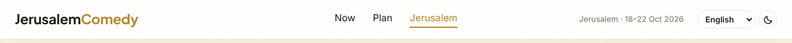 <!-- req-gallery:18.1 -->

  

Notes

  The nav links are `Now` (`../`), `Plan` (`../plan/`) and `Jerusalem`
  (`./`, active). The header hint reads the festival's own run, not
  Edinburgh's.
  

- `18.2` The programme, listed to browse and search, inside the drawer beneath the calendar.

  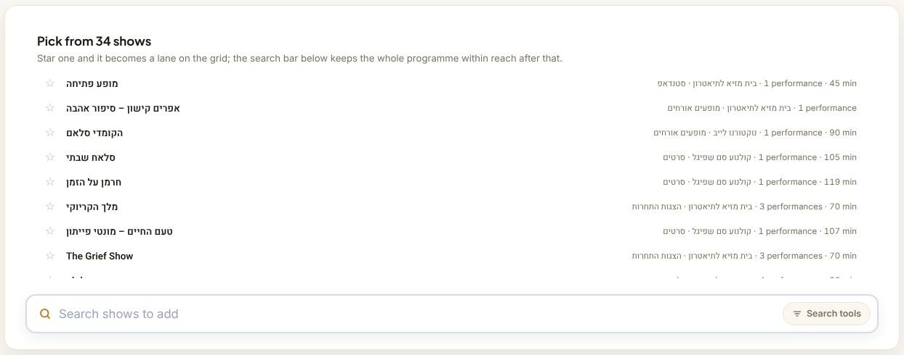 <!-- req-gallery:18.2 -->

  

Notes

  There is no favourites export to upload for this festival, and since the
  calendar drafts from the whole programme there is nothing a reader must star
  before the page is useful. The list is therefore a way to reach a particular
  show, not the way in: it lives in the drawer, opened from under the calendar.
  

- `18.3` A Hebrew show name renders in Hebrew, right-to-left, wherever the page names a show.

  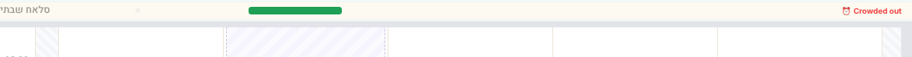 <!-- req-gallery:18.3 -->

  

Notes

  Rendered as one grid lane and one search result for the same show: the title,
  its venue and its category are the source's own Hebrew, each carrying
  `lang="he"` and `dir="rtl"` so punctuation and mixed Latin sit on the correct
  side. Nothing is transliterated.
  

- `18.4` The day grid, in the drawer: one lane per show you have ruled on, its nights marked, its verdict named.

  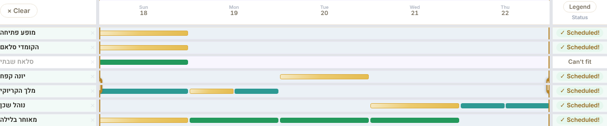 <!-- req-gallery:18.4 -->

  

Notes

  Five columns, one per night the programme uses. A lane is drawn for every
  show a verdict has touched — locked, favourited or rejected — so the drawer
  reads as the record of what you have decided rather than as the pool the
  calendar draws from, which is now the whole programme. The festival publishes
  no live availability and never cancels, so a mark is only ever on sale or
  free and the Edinburgh grid's sold-out and offer-status colours never appear;
  the performance the calendar drafted is gold. The lane that cannot be fitted
  says so.
  

- `18.5` The schedule: the catchable shows fitted across the window, with the walk between venues.

  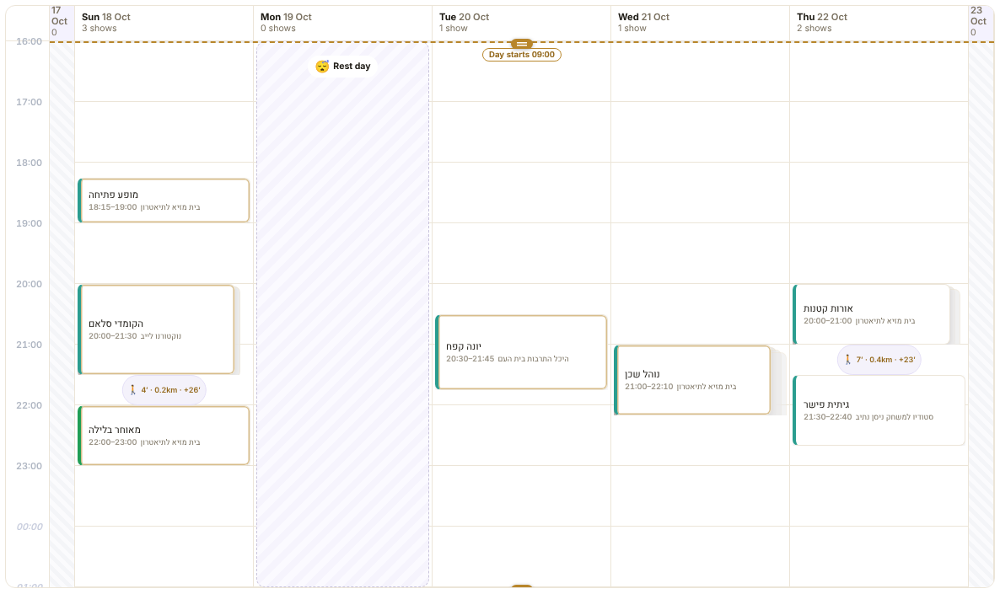 <!-- req-gallery:18.5 -->

  

Notes

  Six venues inside one square kilometre of central Jerusalem, so the travel
  legs are short; two of them share a building and the leg between them is
  zero.
  

- `18.6` "Find a bed" opens Booking.com's Hebrew edition for Jerusalem, on the window's own nights.

  🚩 _Behavior leaf._ <!-- req-gallery:18.6 -->

  

Notes

  Asserted as the URL the link carries, never followed: the `searchresults.he.html`
  path, `ss=Jerusalem`, `selected_currency=ILS`, and the check-in/check-out
  taken from the date window.
  

- `18.7` "Getting here" offers the paid airport transfer and the train beside it.

  🚩 _Behavior leaf._ <!-- req-gallery:18.7 -->

  

Notes

  Two links, both asserted as URLs. Israel Railways runs no referral
  programme; it is offered anyway because it is the cheapest way in from the
  airport, and it ships untagged.
  

- `18.8` Starred shows survive a reload, and never reach the Edinburgh planner's own stored list.

  🚩 _Behavior leaf._ <!-- req-gallery:18.8 -->

  

Notes

  Driven: star two shows, reload, and the same two lanes are back. The
  Edinburgh planner's `localStorage` key is untouched throughout — the two
  planners share code, never state.
  

- `18.9` Exported times are Jerusalem wall clock, and a show with no published running time is exported as an instant.

  🔧 _Logic leaf._ <!-- req-gallery:18.9 -->

  

Notes

  The ICS carries `Asia/Jerusalem` times and that zone's own `VTIMEZONE`, so a
  calendar anywhere in the world shows the hour the audience will be in the
  room. Four of the festival's shows publish no running time; those export with
  end equal to start rather than a guessed length, which is the same
  unknown-is-a-state discipline the price fields keep.
  

## 19. The reader's language, direction and theme

The programme is Hebrew and the reader may not be. The page's own chrome is
translated — English, Hebrew, Russian and Japanese — and follows the reader's
choice of direction and theme; the shows' own names, venues and kinds stay in
the source's Hebrew whichever language the chrome is in. Every string is keyed
in one translations file that carries, per key, the width its slot can afford.

- `19.1` The whole page in Hebrew: the layout mirrors, right to left.

  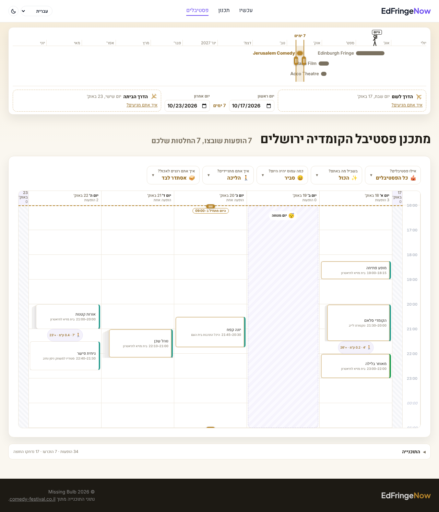 <!-- req-gallery:19.1 -->

  

Notes

  One whole-page golden, deliberately: what this leaf asserts is that the
  *layout* survives the flip — the header, the board's browse list, the
  preference questions and the calendar's day columns and blockers all run the
  other way — not how any one component reads. The pages' own
  right-to-left components are proven here rather than replicated leaf by leaf
  across Part V.
  

- `19.2` The whole page in dark mode.

  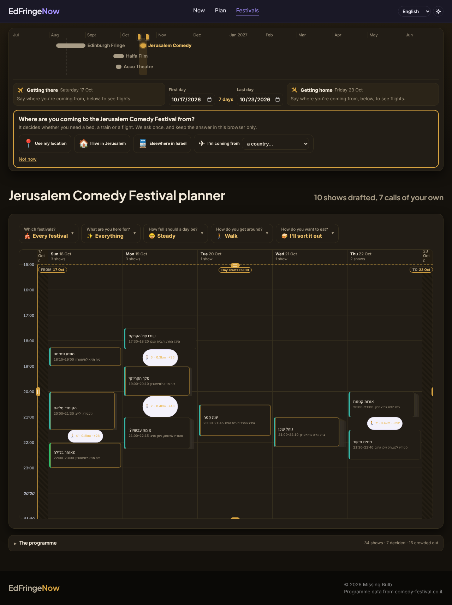 <!-- req-gallery:19.2 -->

  

Notes

  Rendered with the device asking for a dark colour scheme and nothing stored,
  so what the golden proves is the default the system preference gets. The
  header's toggle overrides it either way.
  

- `19.3` The same chrome in Russian and in Japanese.

   <!-- req-gallery:19.3 -->

  

Notes

  The header, the board's heading and count, and the preference questions in
  both languages, stitched. Two more scripts on the same slots is what catches a
  layout that only ever fitted English.
  

- `19.4` The theme a reader picks survives a reload.

  🚩 _Behavior leaf._ <!-- req-gallery:19.4 -->

  

Notes

  Driven: pick a theme, reload, and the page comes back in it — stored under
  the festival's own storage prefix, so the Edinburgh planner's keys are
  untouched. The theme is the only preference storage carries; the language is
  the URL's, under 19.7.
  

- `19.5` Every string the page can render carries a translation in every supported language.

  <table><thead><tr><th align="left">Language</th><th align="left">Code</th><th align="left">Direction</th><th align="left">Plural categories</th></tr></thead><tbody><tr><td>English</td><td>en</td><td>ltr</td><td>one, other</td></tr><tr><td>עברית</td><td>he</td><td>rtl</td><td>one, two, other</td></tr><tr><td>Русский</td><td>ru</td><td>ltr</td><td>few, many, one, other</td></tr><tr><td>日本語</td><td>ja</td><td>ltr</td><td>other</td></tr></tbody></table> <!-- req-gallery:19.5 -->

  

Notes

  Proved against the shipped catalogue: no key missing a language, no empty
  string, no key without a pixel budget, the same placeholders in every
  language, and every plural form the language's own CLDR categories require.
  

- `19.6` Every translated string fits the pixel budget its key declares, in every language and layout.

  🚩 _Behavior leaf._ <!-- req-gallery:19.6 -->

  

Notes

  A budget is a width in CSS pixels, per key — XLIFF 1.2's `maxwidth` with its
  own default `size-unit="pixel"`. Each string is measured where it actually
  renders: a clone of its own slot in the real page, under the pinned
  Chromium's own fonts, across every language and both committed viewports, so
  the number a translator is given is the number the browser will hold them to.
  

- `19.7` The page's language is the one its URL names, and nothing else changes it.

  🚩 _Behavior leaf._ <!-- req-gallery:19.7 -->

  

Notes

  One URL per language — English at the planner's own address, each other
  language a path segment under it. Driven with the device asking for Hebrew:
  the bare URL still answers in English, because a page that redirects on a
  device preference is a page whose other versions no reader and no crawler
  can reach. Nothing about the language is stored, so the same link opens the
  same language for everyone.
  

- `19.8` Choosing a language in the picker takes the reader to that language's URL.

  🚩 _Behavior leaf._ <!-- req-gallery:19.8 -->

  

Notes

  The picker is the only way to change language now that no device preference
  and no stored choice do, so it navigates rather than re-rendering in place —
  which is what leaves the reader on an address they can bookmark and share.
  

- `19.9` Every language's page is served already in that language, before any script runs.

  <table><thead><tr><th align="left">URL</th><th align="left">Language</th><th align="left">html lang</th><th align="left">Direction</th></tr></thead><tbody><tr><td>/planJerusalem/</td><td>English</td><td>en</td><td>ltr</td></tr><tr><td>/planJerusalem/he/</td><td>עברית</td><td>he</td><td>rtl</td></tr><tr><td>/planJerusalem/ru/</td><td>Русский</td><td>ru</td><td>ltr</td></tr><tr><td>/planJerusalem/ja/</td><td>日本語</td><td>ja</td><td>ltr</td></tr></tbody></table> <!-- req-gallery:19.9 -->

  

Notes

  Read off the committed bytes of each page rather than a rendered one: the
  document's own language and direction, its title and description, and every
  string the markup binds, all in that language before a line of JavaScript
  has run. This is the half that fixes what a browser offers to translate —
  it decides from the document it received, not from what the page later
  becomes.

  The pages are generator output. `scripts/localize-pages.mjs` derives them
  from the planner's own `index.html`, and `--check` re-derives and compares,
  so a hand-edit or a drifted source fails the gate rather than shipping.
  

- `19.10` Each page names itself as canonical and points at every other language, including a default.

  🔧 _Logic leaf._ <!-- req-gallery:19.10 -->

  

Notes

  A self-referencing `rel="canonical"` on every language, and a reciprocal
  `hreflang` set — each page listing all four languages plus `x-default` on
  the bare URL — which is what tells a search engine that these are one page
  in four languages rather than four pages competing with each other. Asserted
  over the committed HTML, both directions: every alternate resolves to a page
  that exists, and every page that exists is listed by all the others.

## 20. Deciding in the calendar

The page's own model, and the one thing it does that the Edinburgh planner does
not. The calendar leads: it drafts from the **whole programme**, before anyone
has starred anything, by asking of each contested hour "who else could you be
watching, and which of them will you not get another chance at?" The scarcest
contender takes the hour — a show with one night beats a show with three,
because the three-night show can be caught tomorrow.

A contested hour is drawn as what it is: the card that won, in front of the
cards it beat. The face of a card carries only the show — its name, its hour,
its venue, and a mark when the reader has locked it. Everything the page has to
say *about* that card, and the four answers back — **lock this night**,
**favourite the show**, **not this night**, **not this show** — are in the
popup that opens under the pointer, so a calendar at rest reads as a calendar
rather than as a control panel.

- `20.1` The calendar leads the page: every night of the window drafted from the whole programme, with nothing starred.

  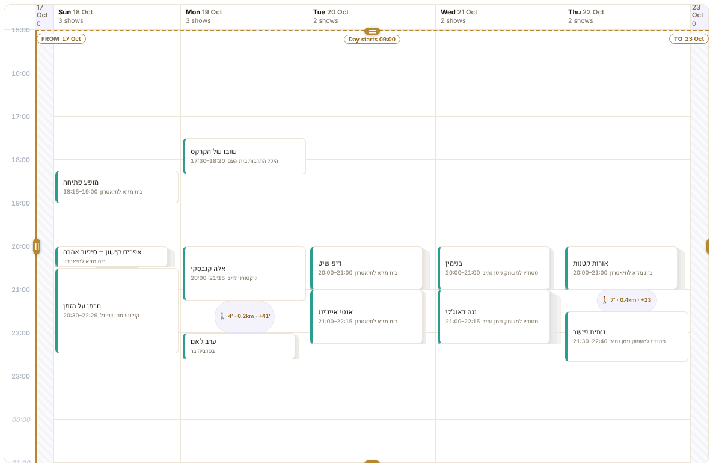 <!-- req-gallery:20.1 -->

  

Notes

  Rendered with empty storage — no favourites, no verdicts — which is the state
  a first visit lands in. Under the old model that state was an empty schedule
  and a prompt to go and star something; here it is a full week.
  

- `20.2` A contested hour is drawn as a stack: the card that won, in front of the ones it beat.

  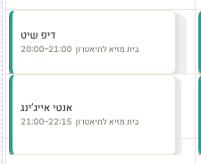 <!-- req-gallery:20.2 -->

  

Notes

  The cards behind are the shows the scarcity rule turned down for that hour,
  one edge each, so how contested an hour was is something the calendar shows
  rather than something it says. An uncontested hour is a single card.
  

- `20.3` Clicking the stack offers the hour to one of the shows behind it.

  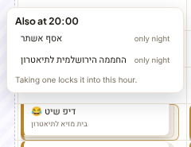 <!-- req-gallery:20.3 -->

  

Notes

  Each is named with the count of nights that lost it the hour, and taking one
  is the same act as locking a night: it holds the hour from then on. Only
  shows that could really take it are offered — see `20.11`.
  

- `20.4` Hovering a card opens everything about it: how rare the show is, every night it plays, and the four verdicts.

  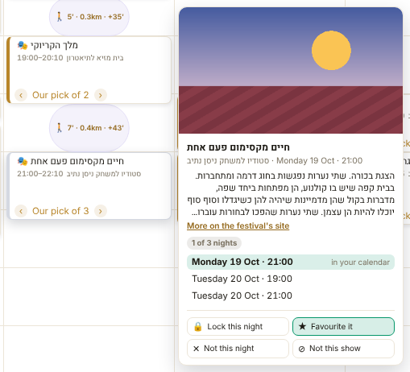 <!-- req-gallery:20.4 -->

  

Notes

  One popup, because these are one thought: how few nights the show has is the
  reason it holds the hour, its other nights are what "not this night" would
  fall back on, and the four buttons are the answers. Nothing here is on the
  card's own face. The popup is reached by pointer and by keyboard alike, and
  stays open while the pointer travels into it, because it is something to act
  on rather than something to read.
  

- `20.5` A locked card is marked as locked, and its hour stops offering anyone else.

  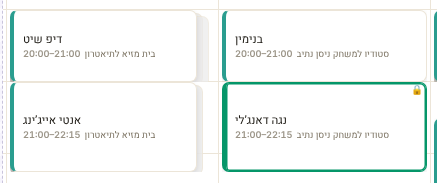 <!-- req-gallery:20.5 -->

  

Notes

  Two nights side by side: one the draft is still guessing at, where both
  hours show what they turned down, and one with a lock in it. The lock is the
  one thing a card's face says beyond the show itself. Nothing on the settled
  night is on offer any more — not only at the locked hour, because what a
  lock rules out for the rest of its night is exactly what `20.11` says it
  does. Unlocking brings the offers back.
  

- `20.6` Locking a night holds it, even against a scarcer contender.

  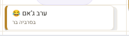 <!-- req-gallery:20.6 -->

  

Notes

  Animated, before and after the lock. A lock is placed before the draft runs,
  so it is the one verdict that can seat a show the scarcity rule would never
  have picked, and the contender it displaces moves to the list of shows it
  beat.
  

- `20.7` "Not this night" moves the show to another of its own nights.

  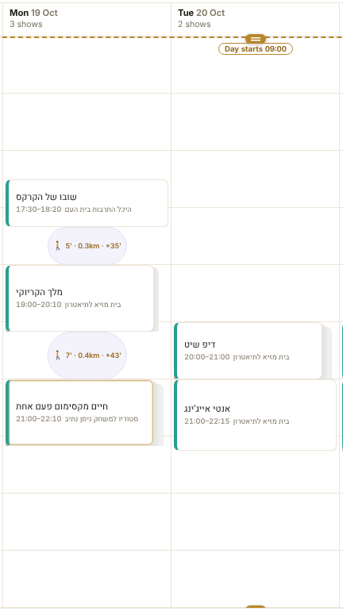 <!-- req-gallery:20.7 -->

  

Notes

  Animated. The rejected night leaves that show's pool and nothing else does,
  so the show competes for its remaining nights as a scarcer show than it was —
  which is the honest reading of a reader who has ruled one night out.
  

- `20.8` "Not this show" hands its hour to the next contender.

  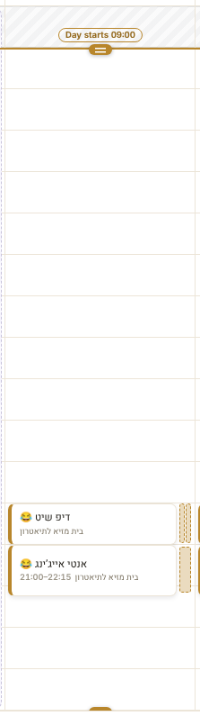 <!-- req-gallery:20.8 -->

  

Notes

  Animated. The show leaves the programme entirely — every night of it, and its
  name off every contender list — and the hour it held is re-drafted from
  whoever is left. Where nobody left can fit the hour, the hour goes empty
  rather than being filled by something that clashes.
  

- `20.9` Verdicts survive a reload, and never reach the Edinburgh planner's own stored list.

  🚩 _Behavior leaf._ <!-- req-gallery:20.9 -->

  

Notes

  Driven: lock one night, reject another show, reload, and the calendar comes
  back drafted the same way. Stored under the festival's own prefix, like every
  other thing this page remembers.
  

- `20.11` An hour is only ever offered to a show that could really take it.

  🔧 _Logic leaf._ <!-- req-gallery:20.11 -->

  

Notes

  Two ways a contender is no offer at all, and both are filtered before the
  stack is drawn rather than discovered after the reader picks. A show already
  drafted somewhere else in the calendar is one: offering it here would be
  offering to move it, which is not what the picker says it does. A show that
  cannot be reached from the night's other shows is the other — the walk
  between the venues and the rest the reader asked for between shows are the
  same constraint the draft itself obeys, so an offer that ignored them would
  be an offer to break the day.
  

- `20.10` The draft's order of precedence, verdict by verdict.

  <table><thead><tr><th align="left">Verdict</th><th align="left">What it does to the show's nights</th><th align="left">When the show is placed</th></tr></thead><tbody><tr><td>Lock this night</td><td>all stay; that one is taken, your day hours and all</td><td>first, before anything else</td></tr><tr><td>Favourite the show</td><td>all stay</td><td>after the locks, before the undecided rest</td></tr><tr><td>Not this night</td><td>that night leaves</td><td>with the rest, from what is left</td></tr><tr><td>Not this show</td><td>every night leaves</td><td>never — and no block offers it either</td></tr><tr><td>No verdict</td><td>all stay</td><td>with the rest, scarcest first</td></tr></tbody></table> <!-- req-gallery:20.10 -->

  

Notes

  A table generated from the shipped drafter: for each verdict, what it does to
  the show's pool of nights and when it is placed relative to the undrafted
  rest. Read top to bottom it is the whole selection rule.
  

## 21. Saying what you want

The calendar drafts before the reader has said anything, so what they say is
not a form standing in front of it: it is a row of questions above the
calendar, each asked in one line and answered by picking a picture, and four
blockers on the calendar itself. A question that has a finer answer behind it
opens to show it — the picture is the short way to a setting, never the only
way. Nothing above the calendar explains the calendar.

- `21.1` Four questions above the calendar: what you are here for, how full a day, how you get around, how you eat.

   <!-- req-gallery:21.1 -->

  

Notes

  Each question is one line and two to five picture answers, and the row is the
  whole of the page's chrome above the calendar: the panel's heading, the
  paragraph that explained contention and the "N shows across N nights" summary
  are all gone. Rendered with nothing stored, so the golden is the set of
  answers a first visit opens on.
  

- `21.2` A question opens on the exact numbers behind its pictures.

  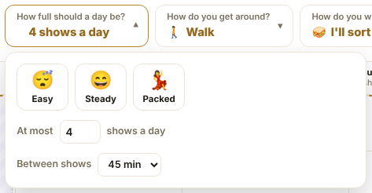 <!-- req-gallery:21.2 -->

  

Notes

  "How full a day?" opened: the three pictures still selected as before, with
  the shows-per-day count and the rest between shows they stand for now
  editable underneath. A picture is a shortcut to a pair of numbers rather than
  a coarser control than them, so opening the question never discards the
  answer already given.
  

- `21.3` A kind you are here for outranks one you are not, and a day takes at most one show from outside them.

  <table><thead><tr><th align="left">What you said</th><th align="left">Which shows are drafted first</th><th align="left">How many a night from outside it</th></tr></thead><tbody><tr><td>Nothing — every kind</td><td>the scarcest, whatever kind it is</td><td>no limit: a night takes what fits</td></tr><tr><td>Some kinds</td><td>the scarcest of those kinds</td><td>one, then the night is full of them</td></tr><tr><td>Some kinds, and a favourite outside them</td><td>locks, then the favourite, then those kinds</td><td>the favourite is placed anyway, and is the one</td></tr></tbody></table> <!-- req-gallery:21.3 -->

  

Notes

  A table generated from the shipped drafter: for each kind of reader — one
  with no interests stated, one with some — when a show of a chosen kind is
  placed relative to the rest, and how many shows from outside the chosen kinds
  one day may take. Saying what you are here for narrows nothing: an hour no
  chosen kind wants is still filled, and the whole programme is still in the
  drawer. What the reader would want instead of that one-a-day cap is the
  variety question, which `21.4` says is not yet wired.
  

- `21.4` The variety question is offered, and says plainly that it does not work yet.

  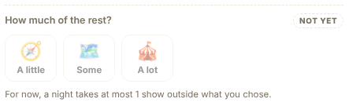 <!-- req-gallery:21.4 -->

  

Notes

  How much of the festival outside your own taste you want is the question that
  should set the cap in `21.3`, and the rule that answers it has not been
  decided. It is drawn where it belongs — behind "what are you here for?",
  which is the question it refines — marked as not yet wired and refusing to be
  answered, rather than left out and added later, and rather than drawn live
  over a rule that ignores it, which is the shape that would lie.
  

- `21.5` A meal you asked for is a band the calendar drafts around; sorting food out yourself leaves the day clear.

  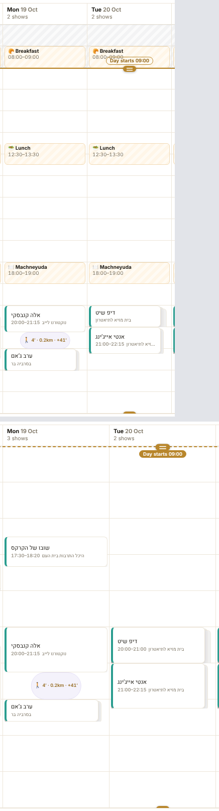 <!-- req-gallery:21.5 -->

  

Notes

  The same two nights twice, stitched: once with breakfast, lunch and dinner
  asked for — each a band nothing is drafted through, carrying the place when
  the reader has named one — and once with "I'll sort it out myself", which
  draws no bands at all and is the reader's signal to stop crowding the
  calendar with food.

  Naming the place is the reader's own for now. Choosing it for them — from
  what is open, close enough to reach between the shows either side, and in
  the style and price they said they wanted — is the question this row is
  shaped for and does not yet answer.
  

- `21.6` Where your day starts and ends are blockers on the calendar, dragged to where you want them.

  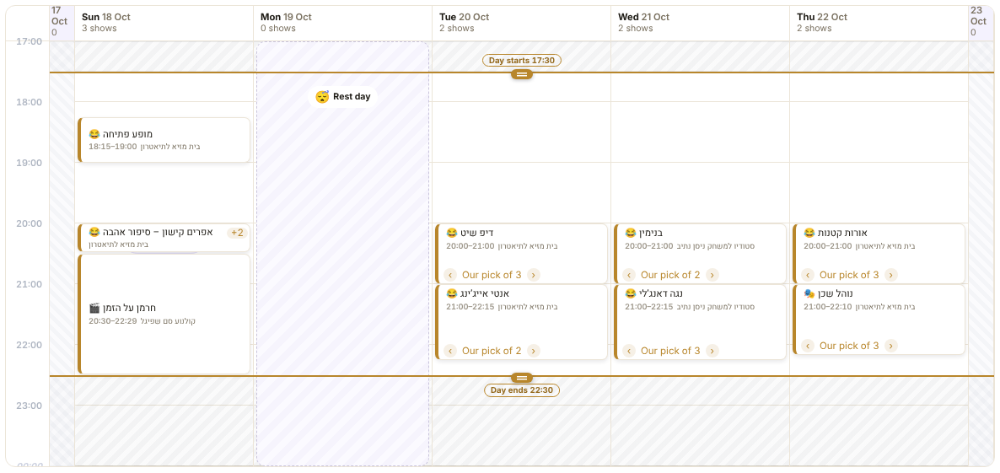 <!-- req-gallery:21.6 -->

  

Notes

  Two draggable lines with the shut-out hours shaded behind them, on the
  calendar rather than in a strip above it: the constraint is drawn against the
  hours it applies to, so what it rules out is visible beside it. The axis
  covers the evening the festival actually runs and stretches only an hour
  beyond it towards a slack boundary, which is then drawn on the axis edge with
  the hour it really holds on its flag; a day genuinely that long — three meals
  asked for, say — draws its hours shorter instead, so the calendar stays a
  calendar rather than a screen of empty morning.
  

- `21.7` Dragging the day's end earlier drops what no longer fits.

  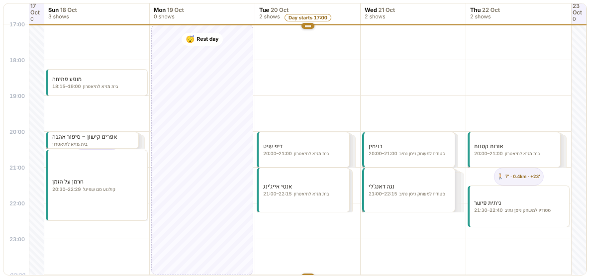 <!-- req-gallery:21.7 -->

  

Notes

  Animated, before and after the drag. The draft is rebuilt from the whole
  programme as the line moves, so what the constraint costs is the calendar
  redrawing rather than a number changing.
  

- `21.8` The first and last nights are the same kind of blocker, on the same calendar.

  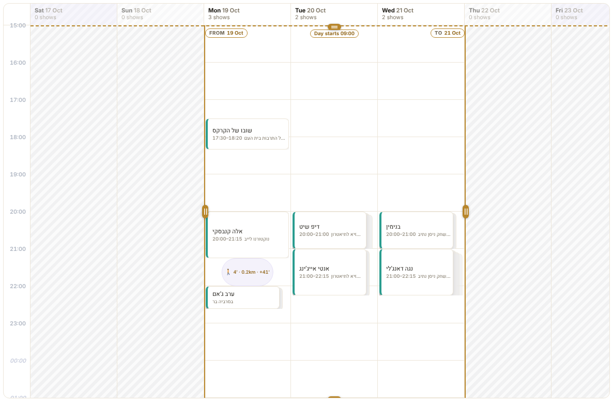 <!-- req-gallery:21.8 -->

  

Notes

  Every night of the festival is a column whether or not the reader's window
  takes it; the nights outside it are shaded like the hours outside the day,
  with a draggable edge at each end of the window. The date window therefore
  lives on the calendar with the other three constraints, rather than on a rail
  over the drawer's grid.
  

- `21.9` Every preference survives a reload.

  🚩 _Behavior leaf._ <!-- req-gallery:21.9 -->

  

Notes

  Driven: state an interest, open a question and change a number, ask for
  dinner, move the day's end and the first night, reload, and all of it comes
  back — stored under the festival's own prefix like everything else this page
  remembers.
# Part VI — what the site tells a crawler

A public website has to be findable, and findable is a thing the site states
rather than a thing a search engine guesses: which pages it publishes for a
reader, which of them are the same page in another language, and which are not
for listing at all. Google's own guidance asks for both files below — a sitemap
so nothing depends on a crawler finding its way to every page by link alone,
and a `robots.txt` naming it. Both are generated from the published tree, so a
page cannot be added to the site and forgotten here.

## 22. The sitemap and robots.txt

- `22.1` The sitemap lists every page the site publishes for a reader.

  <table><thead><tr><th align="left">URL</th><th align="left">Served from</th></tr></thead><tbody><tr><td>/</td><td>index.html</td></tr><tr><td>/accessibility.html</td><td>accessibility.html</td></tr><tr><td>/plan/</td><td>plan/index.html</td></tr><tr><td>/planJerusalem/</td><td>planJerusalem/index.html</td></tr><tr><td>/planJerusalem/he/</td><td>planJerusalem/he/index.html</td></tr><tr><td>/planJerusalem/ja/</td><td>planJerusalem/ja/index.html</td></tr><tr><td>/planJerusalem/ru/</td><td>planJerusalem/ru/index.html</td></tr><tr><td>/privacy.html</td><td>privacy.html</td></tr><tr><td>/terms.html</td><td>terms.html</td></tr></tbody></table> <!-- req-gallery:22.1 -->

  

Notes

  Read off the published tree rather than a list kept by hand, so a page added
  to the site is in the sitemap without anyone remembering: every HTML page
  wrangler uploads, at the URL the site's own trailing-slash handling serves it
  at. No `lastmod`, `changefreq` or `priority` — the first would have to be
  true to be worth anything and nothing here can keep it true, and a search
  engine reads neither of the others.
  

- `22.2` A page that asks not to be indexed is left out of it.

  🔧 _Logic leaf._ <!-- req-gallery:22.2 -->

  

Notes

  The page's own `<meta name="robots" content="noindex">` is what decides,
  rather than a second list beside the sitemap that someone would have to keep
  in step. Two pages say it today: the trip-planner prototype, which is for
  playing with rather than for finding, and the error page, which is not a
  page at all.
  

- `22.3` Each language of the festival planner is listed with the others beside it.

  🔧 _Logic leaf._ <!-- req-gallery:22.3 -->

  

Notes

  The same reciprocal set the pages carry in their own markup (19.10), repeated
  in the sitemap as `xhtml:link` alternates, which is the form a search engine
  is most reliably given it in. Asserted against the pages' own annotations
  rather than against a copy, so the two cannot disagree.
  

- `22.4` `robots.txt` admits every crawler and names the sitemap.

  🔧 _Logic leaf._ <!-- req-gallery:22.4 -->

  

Notes

  A sitemap nothing points at is one a crawler has to be told about out of
  band; the `Sitemap:` line is what makes it discoverable, and it is the only
  reason this file exists here. Nothing is disallowed — what must not be listed
  says so on the page itself (22.2), which keeps it out of results rather than
  merely out of a crawl.
  

