# EdFringeNow — executable UI/UX requirements

What the site's two front-ends must render and how they must behave — Part I
the **Now** page, Part II the **Plan** page. Each numbered leaf is proven by
exactly one executable case; the image under a leaf **is** its expected
rendering, cropped to just what that leaf asserts.

How this document works

The feature-level story of what the product is and why lives in
[docs/product-spec.md](../docs/product-spec.md); this document holds only
statements a test can prove.

Every leaf is executed by exactly one case under
[product/requirements/](requirements/) — see its
[README](requirements/README.md) for the framework: kinds, runners, goldens,
the coverage gate, and how to add or change a requirement. The committed
golden images and coded assertions are the **owner's approval record**: an
agent may propose a new expected, but never changes a committed one to make a
red case pass — on a mismatch it surfaces actual vs expected and asks.

**Numbering.** Every leaf carries a stable id (e.g. `6.4`). Add new
requirements under new numbers; never renumber or reuse a retired one. Each
leaf has exactly one case named `<slug>.<id>.case.js`; the case's *kind* is the
folder it lives in (`screen/` — a pixel-exact golden cropped to the leaf's
scope; `behavior/` — a driven gesture asserted in code; `logic/` — a pure rule
proved against the shipped module). The line under each leaf tagged
`req-gallery` is machine-managed (the gallery generator rewrites it); the prose
is hand-authored.

**The reference moment.** Visual cases render at **Sat 15 Aug 2026, 19:30**
Edinburgh time, from a fixed fake location in central Edinburgh, against the
frozen fixture dataset ([requirements/shared/reference-now.js](requirements/shared/reference-now.js)).

> ⚠️ **A green build means "claimed", not "fully verified".** The visual cases
> render the real pages in a real (headless, pinned) Chromium, but the network
> is faked from committed fixtures, external links are asserted as URLs and
> never followed, real geolocation/GPS/device clocks are substituted with fixed
> fakes, and downloads are read back as bytes rather than imported anywhere.
> The fixture dataset is a frozen, curated snapshot of the real committed data
> — provenance and its two documented adjustments in
> [requirements/shared/fixtures/build-fixtures.js](requirements/shared/fixtures/build-fixtures.js).

---

# Part I — the Now page

## 1. Page chrome

- `1.1` The desktop header: logo, centred **Now | Plan** nav with **Now** active, location button.

  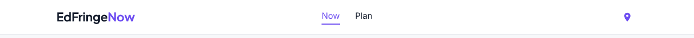 <!-- req-gallery:1.1 -->

  

Notes

  The logo reads `EdFringe` + red `Now`; the nav links are `Now` (`./`, active) and `Plan` (`plan/`); the location button carries `aria-label="Use my location"`. Header is sticky, white, 64px.
  

- `1.2` Below 860px the nav is gone — logo and location button only.

   <!-- req-gallery:1.2 -->

  

Notes

  Golden renders the whole resting page at the 390px reference viewport: no nav links between the logo and the location button.
  

- `1.3` The footer: tagline, copyright, commission disclosure, quick and legal links.

   <!-- req-gallery:1.3 -->

  

Notes

  Disclosure text: `Booking links on plans (tables, trains, stays, tours) may earn us a small commission, at no extra cost to you.` Quick Links column: `Contact Us` (mailto:support@edfringenow.com), `Privacy Policy`; Legal column: `Accessibility`, `Terms of Use`.
  

- `1.4` The footer's copyright line opens a small popup carrying the version.

  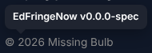 <!-- req-gallery:1.4 -->

  

Notes

  A real in-page element, not a native `title` tooltip — the browser paints those
  itself, so nothing could ever show one to you here. It opens on hover, on focus
  and on tap, closes on Escape, and carries no help cursor.
  

- `1.5` The **debug pill** appears only when geolocation reports a position outside the UK.

  - `1.5.1` Outside the UK, the header carries the debug pill.

     <!-- req-gallery:1.5.1 -->

    

Notes

    The app also keeps its own simulated clock in this state — it adopts the
    device clock only on an in-UK fix — which is why the pill's tools offer a
    simulated "now".
    

  - `1.5.2` In the UK — or with no location at all — no pill.

     <!-- req-gallery:1.5.2 -->

## 2. First-run explainer

- `2.1` A first-time visitor meets the explainer.

  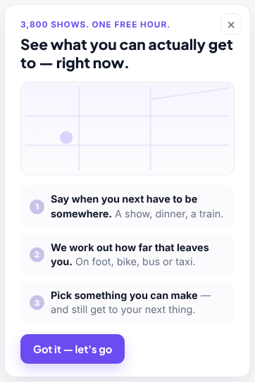 <!-- req-gallery:2.1 -->

  

Notes

  Steps, verbatim: **Say when you next have to be somewhere.** A show, dinner, a train. / **We work out how far that leaves you.** On foot, bike, bus or taxi. / **Pick something you can make** — and still get to your next thing.
  

- `2.2` Dismissing the explainer hides it, and a reload keeps it hidden.

  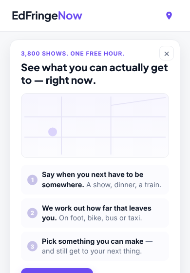 <!-- req-gallery:2.2 -->

  

Notes

  An animated golden: the same page-top region shown, dismissed, and after a
  reload. Remembered in `localStorage` under a key of its own, so clearing a
  stale plan never brings the explainer back.
  

## 3. The next-commitment card

- `3.1` With no commitment, a faded plan skeleton under **Tap to set constraints**.

  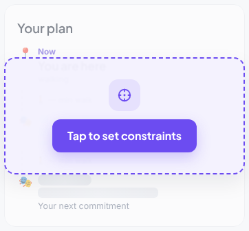 <!-- req-gallery:3.1 -->

- `3.2` The open card: wheels at now + 2 hours, a live count, the pick list, a place input.

  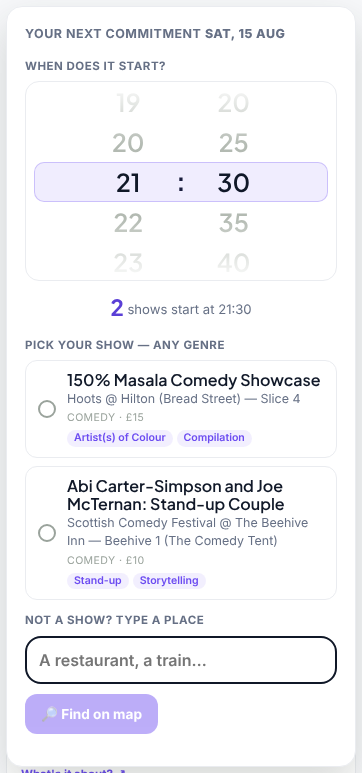 <!-- req-gallery:3.2 -->

  

Notes

  At the reference moment the wheels read `21:30` and the count line reads `2` `shows start at 21:30`; each pick row shows radio, title, venue, genre` · `price. The Find button is disabled while the place input is empty.
  

- `3.3` A minute nothing starts on offers the nearest times instead.

  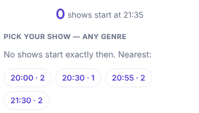 <!-- req-gallery:3.3 -->

- `3.4` Picking a show closes the picker and swaps the intake card for the plan.

  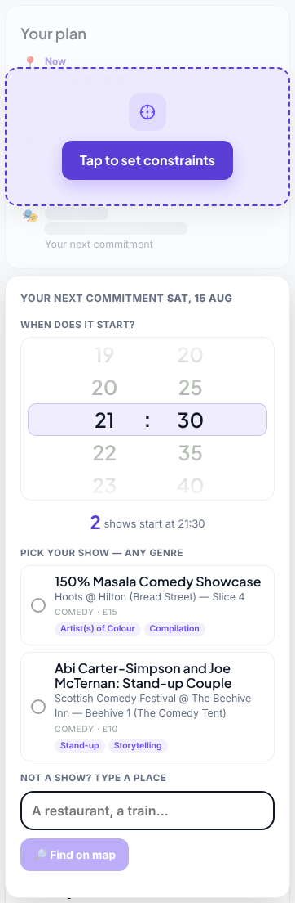 <!-- req-gallery:3.4 -->

  

Notes

  An animated golden: the same card region before and after the pick — the open
  picker, then the plan, with no intake and no open panel.
  

- `3.5` ⚠️ **UNDER-SPECIFIED** — typed-place results: matches around Edinburgh, then a keep-as-note row.

  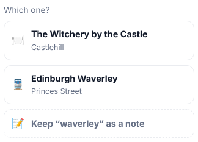 <!-- req-gallery:3.5 -->

  

Notes

  The fixture geocoder answers three hits; the out-of-Edinburgh one is dropped, so the list shows 🍽️ The Witchery by the Castle and 🚆 Edinburgh Waverley, then the 📝 note row.
  

- `3.6` An unreachable geocoder says so — the page’s only error message.

  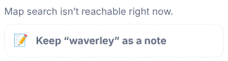 <!-- req-gallery:3.6 -->

- `3.7` The time wheel.

  - `3.7.1` Minutes step by five.

    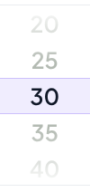 <!-- req-gallery:3.7.1 -->

  - `3.7.2` It opens at now + 2 hours.

    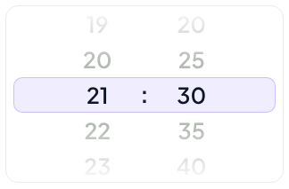 <!-- req-gallery:3.7.2 -->

  - `3.7.3` It ends at 29:55 — the last slot of the fringe day, shown as 05:55.

    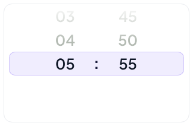 <!-- req-gallery:3.7.3 -->

    

Notes

    The fringe day ends at 06:00, so the wheel stops five minutes short of it;
    hours past midnight display as 00–05 while the value stays extended (29:55).
    

## 4. The plan strip

- `4.1` A committed destination renders the plan: you, the walk, the commitment.

  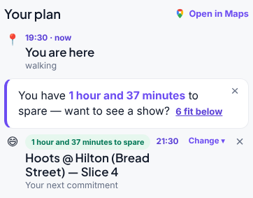 <!-- req-gallery:4.1 -->

  

Notes

  Leg minutes are never shown below 1. Each of the stop/destination nodes carries `Change ▾` and `×` controls.
  

- `4.2` Spare time before the commitment offers what would fit in it.

  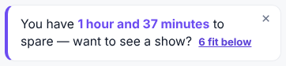 <!-- req-gallery:4.2 -->

  

Notes

  "fits" when n = 1, "fit" otherwise; the link smooth-scrolls to the list.
  

- `4.3` A show slipped into the plan shows its slack and a buy-ahead link.

  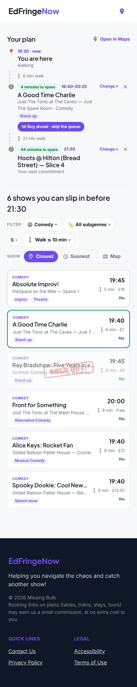 <!-- req-gallery:4.3 -->

  

Notes

  A free show renders no buy link; a sold-out one renders a `Sold out` pill instead (see `6.4` for the list-side stamp).
  

- `4.4` A show that would make you late wears the **You’ll be late** chip.

  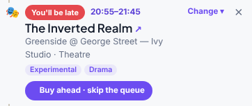 <!-- req-gallery:4.4 -->

- `4.5` The buy-ahead link opens **`https://www.edfringe.com/tickets/whats-on/<slug>`** in a new tab.

  

Proof

  🚩 _Behavior leaf._ <!-- req-gallery:4.5 -->

  `href` equals the pattern with the show's own slug; `target="_blank"`, `rel` includes `noopener`.
  

- `4.6` **Open in Maps** builds a Google Maps directions URL from the user's location to the commitment, in the chosen travel mode, adding the slipped-in show as a waypoint.

  

Proof

  🚩 _Behavior leaf._ <!-- req-gallery:4.6 -->

  `https://www.google.com/maps/dir/?api=1&origin=<lat,lng>&destination=<lat,lng>&travelmode=walking|driving|bicycling` + `&waypoints=` when a leg show is set.
  

- `4.7` Removing one part of the plan leaves the other.

  - `4.7.1` The ✕ on the commitment clears it and keeps the show you picked.

    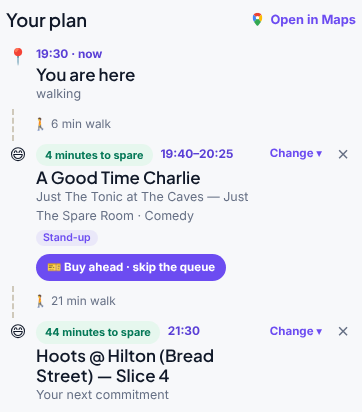 <!-- req-gallery:4.7.1 -->

  - `4.7.2` The ✕ on the show clears just the show.

    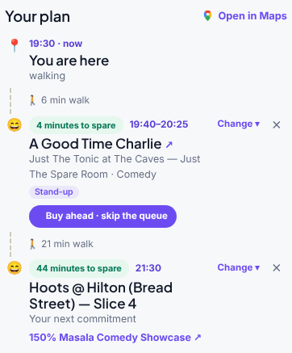 <!-- req-gallery:4.7.2 -->
- `4.8` Durations are phrased for humans.

  <table><thead><tr><th align="left">Minutes</th><th align="left">Reads</th></tr></thead><tbody><tr><td>1</td><td>1 minute</td></tr><tr><td>45</td><td>45 minutes</td></tr><tr><td>60</td><td>1 hour</td></tr><tr><td>80</td><td>1 hour and 20 minutes</td></tr><tr><td>120</td><td>2 hours</td></tr><tr><td>150</td><td>about 2½ hours</td></tr><tr><td>200</td><td>about 3½ hours</td></tr><tr><td>-5</td><td>(nothing)</td></tr></tbody></table> <!-- req-gallery:4.8 -->
## 5. Filters

- `5.1` The genre panel: ten genres, each counted, with an **everything!** hatch.

  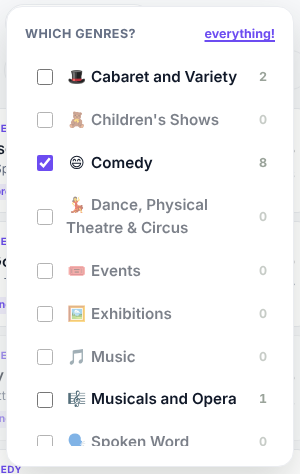 <!-- req-gallery:5.1 -->

  

Notes

  The ten genres, in order: Cabaret and Variety, Children's Shows, Comedy, Dance, Physical Theatre & Circus, Events, Exhibitions, Music, Musicals and Opera, Spoken Word, Theatre. A zero-count row fades. Counts are measured with every filter applied *except* the panel's own.
  

- `5.2` The subgenre panel offers only what the other filters leave standing.

  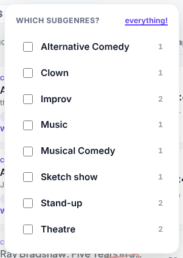 <!-- req-gallery:5.2 -->

- `5.3` The price panel: the shared ladder, each step counted.

  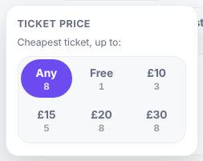 <!-- req-gallery:5.3 -->

- `5.4` The travel panel: three modes with their speeds, and a 1–60 minute budget.

  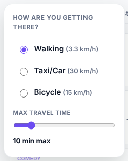 <!-- req-gallery:5.4 -->

- `5.5` Each chip says what it is set to.

  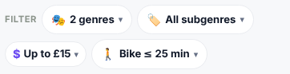 <!-- req-gallery:5.5 -->
- `5.6` **everything!** ticks them all, then flips to **nothing!** and clears them.

  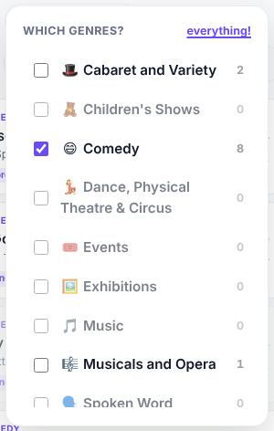 <!-- req-gallery:5.6 -->
- `5.7` Price filtering is honest about unknowns: caps are inclusive (`£10` keeps a £10 show), **Free** means exactly £0, and a show with no known price matches no cap — never smuggled in under one.

  

Proof

  🔧 _Logic leaf._ <!-- req-gallery:5.7 -->

  `shared/price.js` `matchesPrice` / `showPrice`.
  

## 6. View switch and the show list

- `6.1` One selector for view and order: **Closest / Soonest / Map**.

   <!-- req-gallery:6.1 -->

- `6.2` With a commitment the heading counts what still fits, and cards say **fits**.

  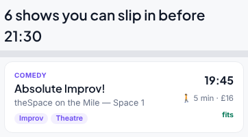 <!-- req-gallery:6.2 -->

  

Notes

  Without a commitment the heading reads `<n> shows you could wander into right now` and only shows starting within the next two hours are listed (singular `show` when n = 1). Card anatomy: genre in red caps, serif title, venue, subgenre tags; right column start time, `🚶 N min · <price>`.
  

- `6.3` **Soonest** groups the same cards under their start times.

  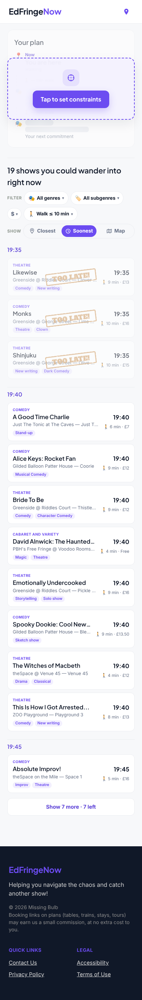 <!-- req-gallery:6.3 -->

- `6.4` A show with no online tickets is stamped **SOLD OUT!** and dims.

  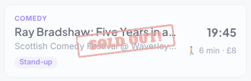 <!-- req-gallery:6.4 -->

  

Notes

  "No online tickets" is decided by `ticketStatus` ∈ {SOLD_OUT, NO_ALLOCATION_CONTACT_VENUE}; unknown status counts as available; the `soldOut` boolean is display-only and never trusted.
  

- `6.5` A show you’d reach just after it starts is stamped **TOO LATE!** and dims.

  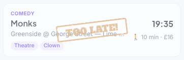 <!-- req-gallery:6.5 -->

  

Notes

  Travel time is straight-line (haversine) at the mode's speed; with a commitment set, tight shows are hidden too — only shows you fully make are offered.
  

- `6.6` A card is exact about price: **Free**, **£N**, or **Price TBC**.

  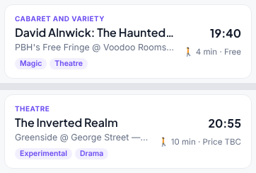 <!-- req-gallery:6.6 -->

- `6.7` Nothing reachable, and the list says what would help.

  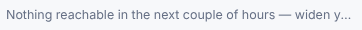 <!-- req-gallery:6.7 -->

- `6.8` Nothing fits before the commitment, and the list says what would help.

  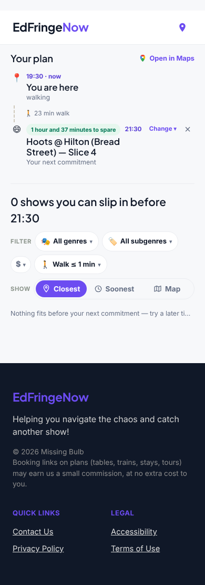 <!-- req-gallery:6.8 -->

- `6.9` The list pages by twelve.

  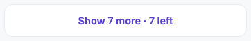 <!-- req-gallery:6.9 -->

- `6.10` **Show more** appends the next page.

  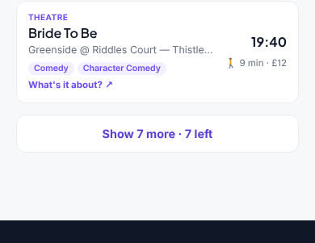 <!-- req-gallery:6.10 -->

- `6.11` Tapping a card slips the show into the plan; tapping again takes it out.

  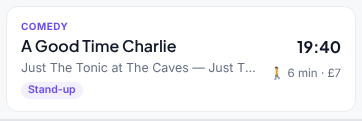 <!-- req-gallery:6.11 -->

## 7. The map

- `7.1` The map: you, how far you can reach, and a pin per show.

   <!-- req-gallery:7.1 -->

  

Notes

  OpenStreetMap tiles (faked in the harness), attribution visible. Pins carry the genre emoji; sold-out/tight pins dim.
  

- `7.2` A commitment draws the route, ending on the deadline you beat.

  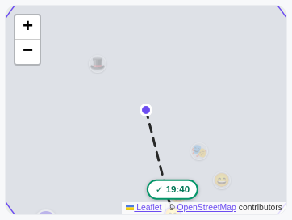 <!-- req-gallery:7.2 -->

  

Notes

  With a slipped-in show the route runs you → show → commitment (two legs); unrelated pins dim to 0.25.
  

- `7.3` Tapping a pin on the map.

  - `7.3.1` It selects that show.

    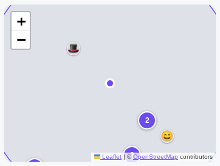 <!-- req-gallery:7.3.1 -->

  - `7.3.2` The page does not scroll — unlike tapping a card in the list.

    

Proof

    🚩 _Behavior leaf._ <!-- req-gallery:7.3.2 -->

    A scroll position is not something a picture of the map can show.
    

# Part II — the Plan page

## 9. Page chrome and board states

- `9.1` The planner’s chrome: **Plan** active, the title, the count, the footer.

  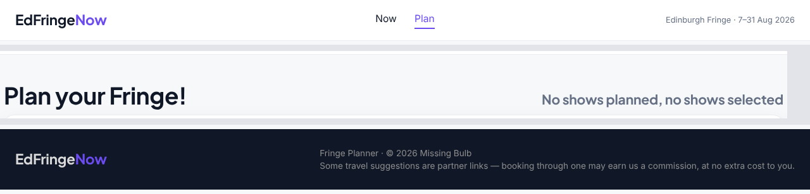 <!-- req-gallery:9.1 -->

  

Notes

  Footer: `Fringe Planner · © 2026 Missing Bulb` + the partner-links disclosure; the © carries the `EdFringeNow v<version>` tooltip.
  

- `9.2` The empty board is the favourites dropzone, search bar beneath it.

   <!-- req-gallery:9.2 -->

- `9.3` A catalogue that won’t load says so, and offers a retry.

  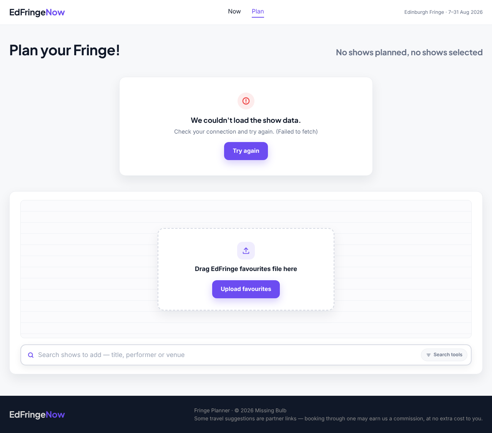 <!-- req-gallery:9.3 -->

- `9.4` **Try again** recovers to the working page.

   <!-- req-gallery:9.4 -->
- `9.5` With shows on the board, the count line reports planned out of selected.

  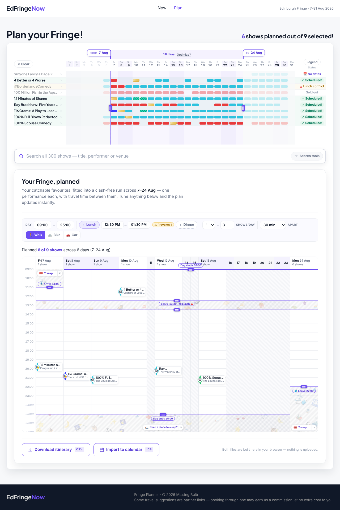 <!-- req-gallery:9.5 -->

## 10. Favourites intake

- `10.1` Uploading the edfringe.com favourites CSV.

  - `10.1.1` It fills the board with every favourite the catalogue knows.

    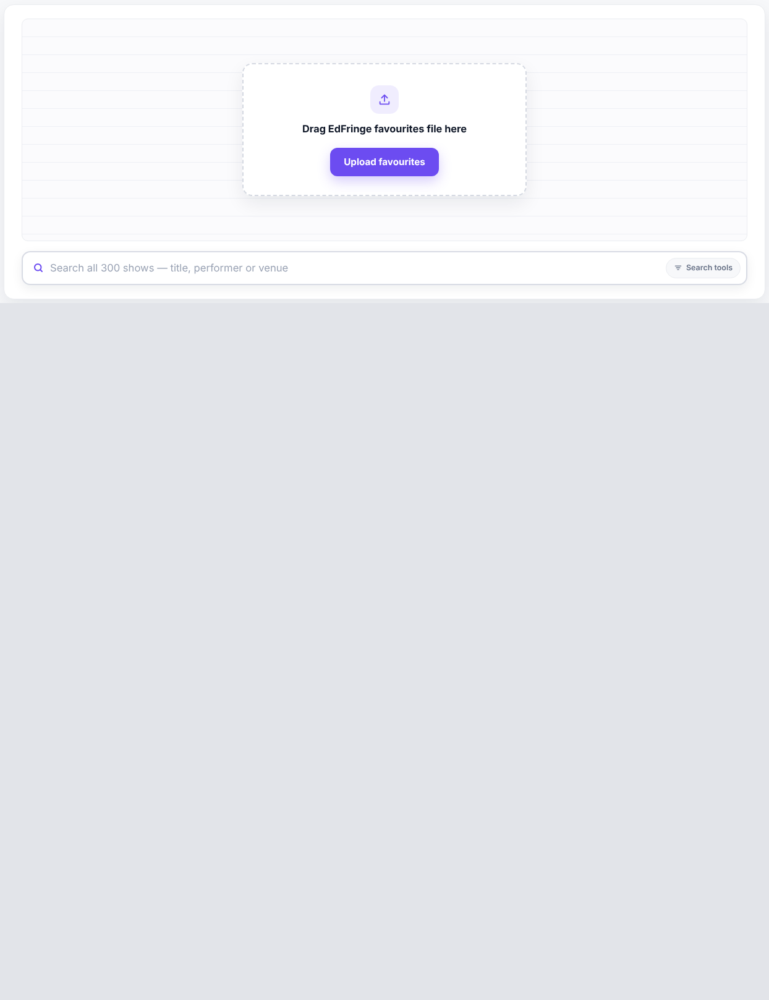 <!-- req-gallery:10.1.1 -->

  - `10.1.2` The board survives a reload.

     <!-- req-gallery:10.1.2 -->

  - `10.1.3` The list is kept for three days.

    

Proof

    🚩 _Behavior leaf._ <!-- req-gallery:10.1.3 -->

    A retention window is a property of stored data over time — no rendering of
    the board can show it.
    

- `10.2` A file that isn’t a CSV is refused.

  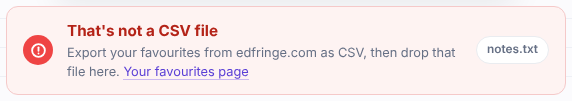 <!-- req-gallery:10.2 -->

- `10.3` A CSV carrying no show links is refused.

  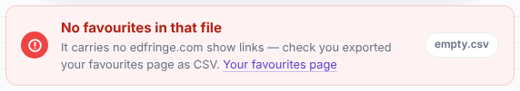 <!-- req-gallery:10.3 -->

- `10.4` Favourites from a previous Fringe are refused.

  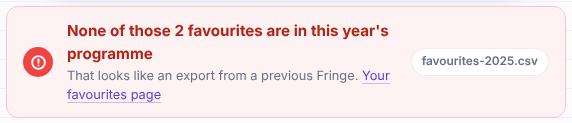 <!-- req-gallery:10.4 -->

- `10.5` A failed upload leaves an existing board untouched.

  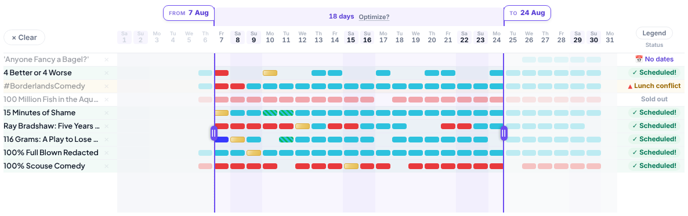 <!-- req-gallery:10.5 -->
- `10.6` The favourites parser reads real exports: quoted RFC-4180 cells, `""` escapes, any line ending, BOM; every cell is scanned for `edfringe.com/tickets/whats-on/<slug>` URLs, de-duplicated in first-seen order; a link-less file falls back to a plain list of URLs or bare slugs.

  

Proof

  🔧 _Logic leaf._ <!-- req-gallery:10.6 -->

  `plan/lib/favourites.js`.
  

- `10.7` **Clear** asks before it wipes.

  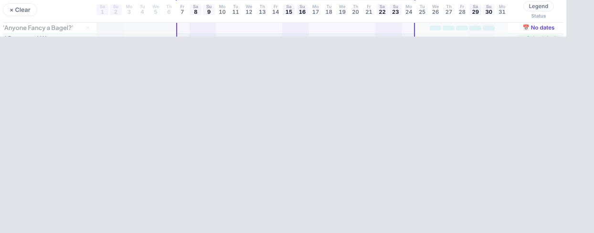 <!-- req-gallery:10.7 -->
## 11. The show search

- `11.1` The search bar invites the whole catalogue.

  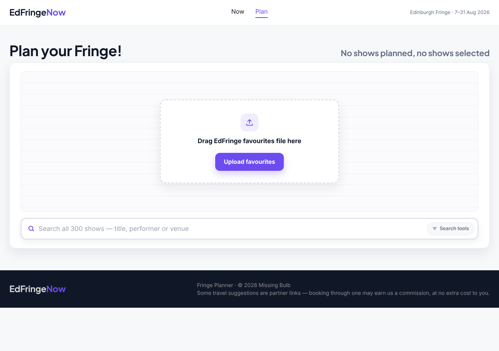 <!-- req-gallery:11.1 -->

- `11.2` A result row: star, title, price · genre · venue · time; a capped list says so.

  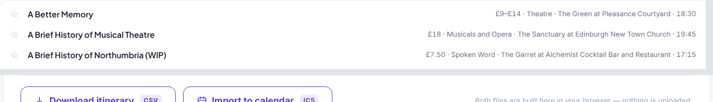 <!-- req-gallery:11.2 -->

- `11.3` A query naming a category offers the category first.

  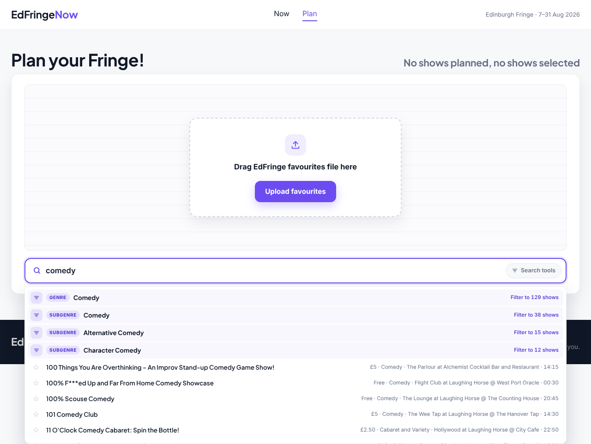 <!-- req-gallery:11.3 -->

- `11.4` Nothing matches, and the search says so.

  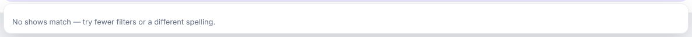 <!-- req-gallery:11.4 -->

- `11.5` Search tools: six facets, each option counted, each clearable.

   <!-- req-gallery:11.5 -->

  

Notes

  Age options: `0+ only`, then `Up to 3+/5+/8+/12+/14+/16+`. Price options are the shared ladder (`8.5`). An option with no data shows an em dash and is disabled.
  

- `11.6` The star adds the show to the grid or lifts it off, from the search row itself.

  

Proof

  🚩 _Behavior leaf._ <!-- req-gallery:11.6 -->
  

- `11.7` Clicking or tabbing away from the search clears the typed text and closes the results — but keeps the facet filters, which live on the tools line (with facets active the popup stays as the filtered browse list).

  

Proof

  🚩 _Behavior leaf._ <!-- req-gallery:11.7 -->
  

- `11.8` Ranking is deterministic and accent-blind: title prefix beats word-boundary beats anywhere-in-title beats performer/venue beats description-only; multi-word queries must land every word; ties break A→Z.

  

Proof

  🔧 _Logic leaf._ <!-- req-gallery:11.8 -->

  `plan/lib/search.js`.
  

## 12. The day grid

- `12.1` The grid: a lane per favourite, a mark per performance, a verdict per row.

   <!-- req-gallery:12.1 -->

- `12.2` The legend names every mark.

   <!-- req-gallery:12.2 -->

  

Notes

  The colours are edfringe.com's own day-picker palette; gold ("In your plan") is the only mark the grid draws itself.
  

- `12.3` A mark’s day card: the show, the date, each performance and its status.

   <!-- req-gallery:12.3 -->

  

Notes

  Status notes: `locked into your plan` / `in your plan` / the status prose (`tickets available`, `sold out`, `free`, …). Hint: `Click a mark to lock that performance in` (or `Click the locked mark to unlock it`).
  

- `12.4` Clicking a mark locks that exact performance into the plan (gold, 🔒); clicking the locked mark unlocks it.

  

Proof

  🚩 _Behavior leaf._ <!-- req-gallery:12.4 -->
  

- `12.5` Clicking a show's name pins the whole show — the plan must include it, whichever performance fits; its other marks wear a dashed gold outline.

  

Proof

  🚩 _Behavior leaf._ <!-- req-gallery:12.5 -->
  

- `12.6` The row's ✕ removes the show; removing the last one returns the board to the intake.

  

Proof

  🚩 _Behavior leaf._ <!-- req-gallery:12.6 -->
  

## 13. The date window

- `13.1` The window rail: **From** and **To** over a dimmed outside.

   <!-- req-gallery:13.1 -->

- `13.2` A window handle moves by keyboard: ←/→ shift it a day, and the flags and ARIA values follow.

  

Proof

  🚩 _Behavior leaf._ <!-- req-gallery:13.2 -->
  

- `13.3` The optimizer picks the best dates for you.

   <!-- req-gallery:13.3 -->

  

Notes

  Best-scoring: most weekend days covered first (when ticked), then most favourites with an available performance, then most available performances.
  

## 14. Scheduling rules

- `14.1` A performance is bookable only when its ticket status says so: sold-out, off-sale, cancelled, postponed, no-allocation **and blank/unknown** all count unavailable; offer statuses (2-for-1, pay-what-you-want) stay bookable.

  

Proof

  🔧 _Logic leaf._ <!-- req-gallery:14.1 -->

  `plan/lib/availability.js` `isAvailable` / `UNAVAILABLE_STATUSES`.
  

- `14.2` A slot must fit the day: it starts no earlier than the day start and ends no later than the day end.

  

Proof

  🔧 _Logic leaf._ <!-- req-gallery:14.2 -->
  

- `14.3` A slot must not overlap an enabled meal break — touching it edge-to-edge is fine.

  

Proof

  🔧 _Logic leaf._ <!-- req-gallery:14.3 -->
  

- `14.4` Between two shows the plan demands `max(chosen gap, travel time)` — travel only *adds* time when it exceeds the gap; a double bill at the same venue needs no travel at all; unknown coordinates fall back to the flat gap.

  

Proof

  🔧 _Logic leaf._ <!-- req-gallery:14.4 -->

  `plan/lib/engine.js` `requiredGapMinutes` / `compatible`.
  

- `14.5` Travel time is straight-line at honest August speeds: walk 3.33 km/h (Edinburgh hills and crowds), bike 15, car 22.

  

Proof

  🔧 _Logic leaf._ <!-- req-gallery:14.5 -->

  `plan/lib/travel.js`.
  

- `14.6` Pinned shows plan first: an exact pinned performance is taken even against day hours and meal breaks; a must-see can never overlap another must-see; pins ignore the per-day cap.

  

Proof

  🔧 _Logic leaf._ <!-- req-gallery:14.6 -->
  

- `14.7` Everything else is packed greedily, earliest finish first, with fully deterministic tie-breaks — the same inputs always give the same plan.

  

Proof

  🔧 _Logic leaf._ <!-- req-gallery:14.7 -->
  

- `14.8` A day left holding fewer shows than the per-day minimum is dropped whole — unless a pinned show sits on it.

  

Proof

  🔧 _Logic leaf._ <!-- req-gallery:14.8 -->
  

- `14.9` Shows past midnight belong to the evening before: a start before 06:00 is folded onto the previous festival day (+1440 minutes), and window membership is judged on that festival date.

  

Proof

  🔧 _Logic leaf._ <!-- req-gallery:14.9 -->
  

- `14.10` No day is packed past the per-day maximum (except by pins).

  

Proof

  🔧 _Logic leaf._ <!-- req-gallery:14.10 -->
  

## 15. Preferences and the schedule

- `15.1` The preferences strip, and what it defaults to.

   <!-- req-gallery:15.1 -->

  

Notes

  Day end accepts up to `27:00` (03:00) — which is why it's a text box, not a native time input. Mode tooltips explain travel is used only when longer than the gap.
  

- `15.2` The schedule: every planned day on one axis, coloured by availability.

   <!-- req-gallery:15.2 -->

  

Notes

  Hours past midnight keep counting (`24:00`, `25:00`, …) so the night reads as one evening. Empty days collapse to slivers. Blocks link to edfringe.com; plain click pins instead.
  

- `15.3` Every row carries an honest verdict.

   <!-- req-gallery:15.3 -->

  

Notes

  Sold-out wins over no-dates (a different window won't help). A pinned row's pill is preceded by 🔒.
  

- `15.4` A conflict explains itself in your own numbers.

   <!-- req-gallery:15.4 -->

- `15.5` A setting that shuts shows out says how many.

   <!-- req-gallery:15.5 -->

  

Notes

  A control is culpable only if relaxing it alone would free at least one performance.
  

- `15.6` There is no Plan button: nudging any preference re-plans instantly.

  

Proof

  🚩 _Behavior leaf._ <!-- req-gallery:15.6 -->

  Editing the day-end box immediately changes the schedule and summary.
  

- `15.7` The plan summarises itself in one sentence.

   <!-- req-gallery:15.7 -->

- `15.8` When nothing fits, the schedule says what to relax.

   <!-- req-gallery:15.8 -->

- `15.9` The plan’s edges carry the two partner suggestions.

   <!-- req-gallery:15.9 -->

  

Notes

  Links are plain deep links until affiliate IDs are configured; `rel="sponsored noopener noreferrer"`.
  

- `15.10` Clicking a conflict pill takes you to the setting responsible and flashes it.

  

Proof

  🚩 _Behavior leaf._ <!-- req-gallery:15.10 -->
  

## 16. Exports

- `16.1` **Download itinerary CSV** produces `fringe-itinerary.csv`: UTF-8 with BOM, CRLF, headers **Date, Day, Start, End, Show, Genre, Venue, Room, Status, Tickets**, one row per planned show.

  

Proof

  🚩 _Behavior leaf._ <!-- req-gallery:16.1 -->
  

- `16.2` **Import to calendar ICS** produces `fringe-plan.ics` pinned to Edinburgh: `DTSTART;TZID=Europe/London` with an embedded VTIMEZONE, a stable UID per show+time (re-import updates, never duplicates), the calendar name **"Fringe 2026 · \<d0\>–\<d1\> Aug"**, and a 30-minute reminder.

  

Proof

  🚩 _Behavior leaf._ <!-- req-gallery:16.2 -->
  

- `16.3` After the ICS download, the two steps into Google Calendar.

   <!-- req-gallery:16.3 -->

- `16.4` Both export buttons are disabled while nothing is scheduled — and the note under them promises **"Both files are built here in your browser — nothing is uploaded."**

  

Proof

  🚩 _Behavior leaf._ <!-- req-gallery:16.4 -->
  

- `16.5` The files are correct to the byte: CSV cells are RFC-4180 escaped; ICS lines fold at 75 octets.

  

Proof

  🔧 _Logic leaf._ <!-- req-gallery:16.5 -->

  `plan/lib/itinerary.js`.
  

---

# Part III — both pages

Features neither page owns alone. Each is proven on the Now page **and** the
planner, in one picture, because a rule that only half the site follows is not
the feature.

## 8. Time and money, everywhere

- `8.1` Both pages run the festival day to 06:00 — a late show belongs to the night before.

   <!-- req-gallery:8.1 -->

  

Notes

  The Now page's wheel stops at the day's last slot, shown as 05:55; the
  planner's schedule counts on past midnight rather than wrapping — 24:00,
  25:00, 26:00. Times are carried in that extended form so they sort correctly,
  and wrapped only where they are displayed.
  

- `8.2` Times are Edinburgh's, whatever your device says.

   <!-- req-gallery:8.2 -->

  

Notes

  The same two pages rendered twice — once with the device in London, once with
  it in New York. Every time on both is identical: a doors-at-19:45 show is
  19:45 wherever you are reading from.
  

- `8.3` The page's clock can be driven, for testing.

   <!-- req-gallery:8.3 -->

  

Notes

  Now-page only — the planner has no live clock to drive. The picker round-trips:
  the moment you set is the moment the page then reads as "now".
  

- `8.4` The clock moves on by itself.

   <!-- req-gallery:8.4 -->

  

Notes

  Now-page only. The plan's "now" advances a minute at the turn of the minute,
  not a minute after the page happened to load.
  

- `8.5` Both pages offer the same ticket-price ladder.

   <!-- req-gallery:8.5 -->

- `8.6` Prices are written the same way everywhere.

  <table><thead><tr><th align="left">What is known</th><th align="left">Reads</th></tr></thead><tbody><tr><td>nothing</td><td>Price TBC</td></tr><tr><td>£0</td><td>Free</td></tr><tr><td>one band, £12</td><td>£12</td></tr><tr><td>one band, £8.50</td><td>£8.50</td></tr><tr><td>£12 to £18</td><td>£12–£18</td></tr></tbody></table> <!-- req-gallery:8.6 -->

  

Notes

  Rendered on a card by `6.6` and on a search row by `11.2`; the rule itself is
  the table. An unknown price is never quietly written as free or as £0.
  

---

# Part IV — the trip planner prototype (`/plan2`)

A playable prototype of the illustrated trip planner (design-concepts/trip-planner):
the Postcard direction's opening and question cards, a calendar draft with vertical
day columns, and peel-to-correct tickets — running on committed test data for a
handful of cities, festivals, shows, restaurants, stays, transport modes and day
trips, so the experience can be played with before any of it touches live data.

## 17. The postcard planner

- `17.1` The opening: the city's postcard with its festivals as stamps, the dates as the postmark, and the first question card.

   <!-- req-gallery:17.1 -->

  

Notes

  The card asks "Where to?" with four picture ways in (city, season, genre,
  name); the postcard shows the chosen city; every festival the test data
  knows in that city on those dates is a stamp, the planned-around one on the
  postcard and the rest on an "Also on…" sheet to stick on. The postmark
  carries the arrival and departure dates.
  

- `17.2` A question is a card of picture options; the answer becomes a sticker on the postcard and the card is gone.

   <!-- req-gallery:17.2 -->

  

Notes

  Rendered on "Who's coming?" with the family option chosen and two kids'
  ages set: the earlier answers (city, festivals, dates) already sit on the
  postcard as stickers; the questions still to come are a stack of cards
  behind the current one. A sticker reopens its question.
  

- `17.3` The draft: the postcard turned over as a calendar, days as vertical columns with the hours running down, one ticket per plan item.

   <!-- req-gallery:17.3 -->

  

Notes

  Each kind of item is its own ticket: travel legs, check-in and check-out,
  shows (colour-banded by festival), meals, a day out spanning its hours, and
  free time as a dashed gap. Starred tickets wear a gold ring and are never
  swapped by a redraft. The address side carries the stay and the totals
  (nights, travel, tickets); the "Stick on…" sheet offers a day out, a meal,
  and picking shows yourself.
  

- `17.4` Peeling a ticket reveals the correction stickers; a one-off event reveals only "Not for me".

   <!-- req-gallery:17.4 -->

  

Notes

  A repeating show peels to five stickers: not this time, not this show, no
  more of its genre, not its venue, keep it (star). A show with one
  performance on the trip's dates peels to "Not for me" and keep. Both peels
  are rendered together, one on each kind of ticket.
  

